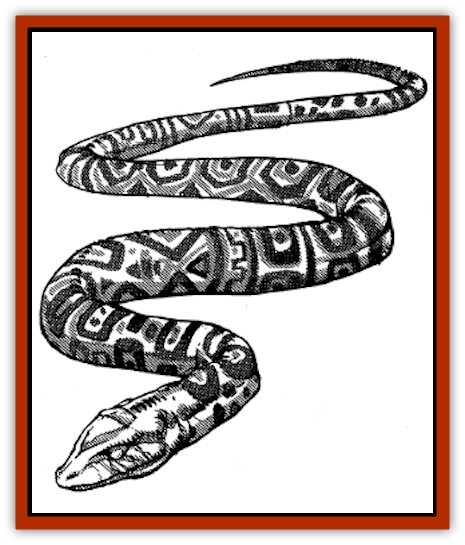

# Zin

| Statistic | **Zin** |
| --- | --- |
| **Activity Cycle:** | Any |
| **Alignment:** | Chaotic neutral |
| **Armor Class:** | 5 |
| **Climate/Terrain:** | Freshwater rivers and lakes |
| **Damage/Attack:** | 1-6 |
| **Diet:** | Carnivore |
| **Frequency:** | Very rare |
| **Hit Dice:** | 5+1 |
| **Intelligence:** | High to Genius (13-18) |
| **Magic Resistance:** | 30% |
| **Morale:** | Average (10) |
| **Movement:** | 12, Sw 12 |
| **No. Appearing:** | 1-6 |
| **No. of Attacks:** | 1 |
| **Organization:** | Bands |
| **Size:** | M (6-12' long) |
| **Special Attacks:** | Poison |
| **Special Defenses:** | See below |
| **THAC0:** | 15 |
| **Treasure:** | W |
| **XP Value:** | 2,000 |

The zin are spirit [[Snake|snakes]] that dwell at the bottom of rivers and lakes. They are shapeshifting, bardic pranksters, delighting in spreading merriment, song, and mischief among the surface dwellers that travel near or across their domains.

In their true form, zin look like pale blue or green snakes. Along their backs, the scales depict a mottled blue and green mosaic pattern, unique to each individual zin. Their coloration makes them difficult to spot while swimming, but they can easily be spotted while resting on a river or lake bed.

**Combat:** Zin all have 60' infravision. They can polymorph into human or demihuman form at will and are most often encountered in this form. The zin each possess the talents and spell abilities of a 5th-level bard, with either the sa'luk, rawun, or barber kits. They can learn four wizard spells (three 1st-level and one 2nd-level), typically choosing from the enchantment/charm and illusion schools (ventriloquism and Tasha's uncontrollable hideous laughter are long-standing zin favorites). Zin equip themselves with the accoutrement typical of a traveling bard. They delight in using magical items.

Although each individual zin possesses a bardic voice, when they play and sing together as a band, their music takes on a supernatural quality that it did not possess before. In order for this eldritch music to be effective, the zin must be within 10 feet of one another. Spells "cast" by a band are extremely difficult to resist (-1 on saves per zin present) and depend upon the number of zin in the band (per the following table).

| Duo: | hold person or suggestion |
| --- | --- |
| Trio: | charm monster or emotion |
| Quartet: | Leomund's lamentable belaborment or chaos |
| Quintet: | mass suggestion or charm plants |

The spell "repertoire" is cumulative (i.e., a quartet knows the spells of a trio and duo). A zin band can collectively cast any spell from their repertoire, once per round, at a level equal to three times the number of zin present.

In their natural form, zin can physically attack with their bite. The victim suffers 1-6 points of damage and must save vs. poison or fall into a catatonic slumber for 24 hours. Upon awakening, the unfortunate will most likely find himself completely naked and probably (if the zin have a malicious streak) dangerously close to the lair of an unpleasant monster.

**Habitat/Society:** Bands of zin dwell together in air-filled caverns at the bottom of rivers and lakes. They are carnivores, subsisting mainly on a diet of fish.

When bored, a group of zin will approach a camp of travelers passing nearby and ask for protection for the night. During their visit, the zin will stretch the limits of the PCs' hospitality with bawdy jokes and a few pranks. If the hosts retain their composure, the zin will perform a small concert in their honor, casting all of the spells in their repertoire to achieve the most humorous and entertaining results (from the point of view of the zin, that is).

Should the hosts adhere to the code of hospitality, they will have at last earned the respect of the zin, who will lavish on them a concert of merriment, song, and mirth lasting the remainder of the evening. In the morning, the zin will wish their hosts luck and long life and trouble them no further.

If the hosts are offended by the zin's antics and betray the sacred trust of hospitality (by attacking one of the zin), the band will attempt to flee into the darkness and plague the party for the remainder of their journey with a nightly concert. At the DM's discretion, on their final nightly visit, the zin will curse their poor hosts with the *evil eye* (no saving throw).

**Ecology:** Zin only care about music, dancing, and having a good time (frequently at the expense of others). They have little concern for the world around them or its ecology, although they will quickly take offense at anything defiling the body of water in which they live.

The hide of a zin is highly prized by all rogues. Zin-hide sandals will increase a rogue's chances of climbing walls and moving silently by 10%. Of course, openly wearing such sandals will earn a rogue the immediate enmity of most zin encountered thereafter (-10 on reaction rolls), who might decide they want a pair of sandals made from the rogue's skin.

---
## Discovery & Documentation

**Source Publication:** MC13 Al-Qadim Appendix (1992)
**Campaign Setting:** Al-Qadim (Forgotten Realms)
**Author(s):** C. Terry Phillips

### Other Creatures Found in This Source Book
   * [[Ammut|Ammut]]
   * [[Ashira|Ashira]]
   * [[Asuras|Asuras]]
   * [[Black_Cloud_of_Vengeance|Black Cloud of Vengeance]]
   * [[Buraq|Buraq]]
   * [[Camel|Camel]]
   * [[Camel_of_the_Pearl|Camel of the Pearl]]
   * [[Centaur_Desert|Centaur, Desert]]
   * [[Copper_Automaton|Copper Automaton]]
   * [[Debbi|Debbi]]
   * [[Elephant_Bird|Elephant Bird]]
   * [[Gen|Gen]]
   * [[Genie_Noble_Dao|Genie, Noble Dao]]
   * [[Genie_Noble_Djinni|Genie, Noble Djinni]]
   * [[Genie_Noble_Efreeti|Genie, Noble Efreeti]]
   * [[Genie_Noble_Marid|Genie, Noble Marid]]
   * [[Genie_Tasked_Architect_Builder|Genie, Tasked, Architect/Builder]]
   * [[Genie_Tasked_Artist|Genie, Tasked, Artist]]
   * [[Genie_Tasked_Guardian|Genie, Tasked, Guardian]]
   * [[Genie_Tasked_Herdsman|Genie, Tasked, Herdsman]]
   * [[Genie_Tasked_Slayer|Genie, Tasked, Slayer]]
   * [[Genie_Tasked_Warmonger|Genie, Tasked, Warmonger]]
   * [[Genie_Tasked_Winemaker|Genie, Tasked, Winemaker]]
   * [[Ghost_Mount|Ghost Mount]]
   * [[Ghul|Ghul]]
   * [[Giant_Desert|Giant, Desert]]
   * [[Giant_Jungle|Giant, Jungle]]
   * [[Giant_Reef|Giant, Reef]]
   * [[Giant_Zakhara_General_Information|Giant (Zakhara), General Information]]
   * [[Hama|Hama]]
   * [[Heway|Heway]]
   * [[Living_Idol|Living Idol]]
   * [[Lycanthrope_Werehyena|Lycanthrope, Werehyena]]
   * [[Lycanthrope_Werelion|Lycanthrope, Werelion]]
   * [[Markeen|Markeen]]
   * [[Maskhi|Maskhi]]
   * [[Mason_Wasp_Giant|Mason Wasp, Giant]]
   * [[Nasnas|Nasnas]]
   * [[Pahari|Pahari]]
   * [[Rom|Rom]]
   * [[Sabu_Lord|Sabu Lord]]
   * [[Sakina|Sakina]]
   * [[Serpent_Lord|Serpent Lord]]
   * [[Serpent_Winged|Serpent, Winged]]
   * [[Silat|Silat]]
   * [[Simurgh|Simurgh]]
   * [[Stone_Maiden|Stone Maiden]]
   * [[Vishap|Vishap]]
   * [[Zaratan|Zaratan]]
