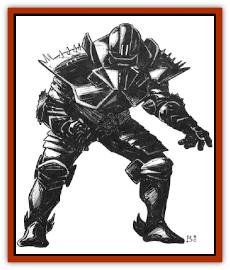

# Zodar

| Statistic | **Zodar** |
| --- | --- |
| **Activity Cycle:** | Any |
| **Alignment:** | Chaotic neutral (good) |
| **Armor Class:** | -8 |
| **Climate/Terrain:** | Any |
| **Damage/Attack:** | 2-40/2-40 or weapon +14 (&times;2) |
| **Diet:** | None |
| **Frequency:** | Very rare |
| **Hit Dice:** | 16+ |
| **Intelligence:** | Unknown |
| **Magic Resistance:** | 100% |
| **Morale:** | Special |
| **Movement:** | 24 (see below) |
| **No. Appearing:** | 1 |
| **No. of Attacks:** | 2 |
| **Organization:** | Solitary |
| **Size:** | M (6' tall) |
| **Special Attacks:** | See below |
| **Special Defenses:** | Invulnerability |
| **THAC0:** | 5 |
| **Treasure:** | See below |
| **XP Value:** | 22,000 |

Zodar are an incredibly powerful race of bipeds. They are all identical, standing exactly six feet tall. Zodar resemble smooth, deep-black suits of obsidian plate armor. This is actually their exoskeleton, which is comprised of material that seems very similar to the crystal shells. They have no facial features except for two small slits, which sages believe are their sensory organs.

Zodar can cause speech to issue from the air about them thrice in a lifetime. Thus they select the times with great care. When a zodar speaks, it uses its words as sparingly as possible. The language used is one that all it wishes to communicate with can understand (if this is impossible, different listeners hear the speech in different languages). No hint of pain, fear, joy, or any other emotion has been issued from a zodar.

The entire internal areas of zodar are comprised of muscle fibers, thus accounting for their incredible 25 Strength. They weigh nearly 500 lbs. Though they rarely demonstrate this, zodar can perform great feats of strength, speed, and endurance. They have been seen leaping as far as 50 feet upward, moving at 48, and lifting things that even a [[Titan|titan]] would shudder at.

**Combat:** Zodar attack with their two arms. They rarely punch opponents, but rather grasp them and crush their bodies.

Occasionally a zodar is seen found wielding one or two weapons. These are almost always melee weapons. They suffer no penalty when attacking with two weapons.

Zodar are impervious to magic (even that which is cast to aid them). Furthermore, only physical blows cause them any obvious harm. Fire, temperature, acid, poison, submersion in water, etc., all have no effect upon them. Zodar do not defend themselves in combat except by attacking back. Their great Armor Class is due to their strange exoskeleton and may be assisted by their unusual relationship with magic.

Three times in a lifetime, a zodar can cause any one spell to occur as if cast by it. Once in a lifetime, a zodar can cause a powerful *wish* to occur. However, the result of this power is almost always something that is not widely known and does not draw attention to this secretive race.

**Habitat/Society:** Zodar can be found literally anywhere, though they avoid large crowds or other situations in which they would draw a lot of attention. They are most frequently found near the crystal shells and many space sages have postulated that they are somehow tied to the protection and maintenance of these shells. The [[Reigar|reigar]] claim to have created them as a whim, but then the reigar claim a lot of things.

They never work side by side or directly against another of their kind. There is no known ranking among their members. Further, no zodar of fewer than 16 Hit Dice has ever been encountered, though tougher ones are not uncommon. The only effect that additional Hit Dice have upon a zodar is to increase its possible hit points and XP value.

Zodar deal with all lesser races in a very aloof manner. Even if they join an adventuring party, they often walk at the back of the group and do nothing else, not even fight. More than one party has died while their zodar stood by like a mysterious black statue witnessing their end. When a zodar does perform some significant action, it is almost always surprising to those around it. A zodar may suddenly enter a fray, march toward a single victim, destroy him, and then freeze in place once the task is completed. A ship may be nearly destroyed when a zodar acts, hefting the main mast and hurling it at the enemy like a great lance.

Space sages have theorized that each zodar has a specific mission that somehow relates to the crystal spheres. It relentlessly pursues this mission, concerning itself only with things related to the mission's success. Thus, joining a party may be for the sake of passage to another place. Perhaps the party's quest somehow furthers its own mission, and it is along to aid them in times of great peril. For these reasons, it is not uncommon for zodar to be found with spacefaring beings, even very insignificant ones!

The only thing a zodar ever carries for any length of time are weapons. Even then, only two at most are found upon a zodar. These weapons are 50% likely to be magical, Magical weapons are 50% likely to be from the special weapons table.

**Ecology:** Zodar have no natural enemies nor do they prey upon anything. The exoskeleton of a zodar would make incredible armor. However, when enough damage is inflicted to kill a zodar, all that is left of its exoskeleton is a bunch of fragments.

---
## Discovery & Documentation

**Source Publication:** MC7 Spelljammer Appendix I (1990)
**Campaign Setting:** Advanced Dungeons & Dragons 2nd Edition
**Author(s):** various

### Other Creatures Found in This Source Book
   * [[Aartuk|Aartuk]]
   * [[Albari|Albari]]
   * [[Ancient_Mariner|Ancient Mariner]]
   * [[Argos|Argos]]
   * [[Beholder_Abomination_Astereater|Beholder (Abomination), Astereater]]
   * [[Blazozoid|Blazozoid]]
   * [[Chattur|Chattur]]
   * [[Chevall|Chevall]]
   * [[Clockwork_Horror|Clockwork Horror]]
   * [[Colossus|Colossus]]
   * [[Delphinid|Delphinid]]
   * [[Dizantar|Dizantar]]
   * [[Dog|Dog]]
   * [[Dog_Bog_Hound|Dog, Bog Hound]]
   * [[Esthetic|Esthetic]]
   * [[Focoid|Focoid]]
   * [[Fractine|Fractine]]
   * [[Giant_Spacesea|Giant, Spacesea]]
   * [[Golem_Furnace|Golem, Furnace]]
   * [[Golem_Radiant|Golem, Radiant]]
   * [[Gravislayer|Gravislayer]]
   * [[Grommam|Grommam]]
   * [[Hadozee|Hadozee]]
   * [[Hamster_Giant_Space|Hamster, Giant Space]]
   * [[Jammer_Leech|Jammer Leech]]
   * [[Lakshu|Lakshu]]
   * [[Lumineaux|Lumineaux]]
   * [[Lutum|Lutum]]
   * [[Mimic_Space|Mimic, Space]]
   * [[Misi|Misi]]
   * [[Moon_Rogue|Moon, Rogue]]
   * [[Mortiss|Mortiss]]
   * [[Murderoid|Murderoid]]
   * [[Nay-Churr|Nay-Churr]]
   * [[Phlog-Crawler|Phlog-Crawler]]
   * [[Plasman|Plasman]]
   * [[Plasmoid_DeGleash|Plasmoid, DeGleash]]
   * [[Plasmoid_DelNoric|Plasmoid, DelNoric]]
   * [[Plasmoid_General_Information|Plasmoid, General Information]]
   * [[Plasmoid_Ontalak|Plasmoid, Ontalak]]
   * [[Puffer|Puffer]]
   * [[Q'nidar|Q'nidar]]
   * [[Rastipede|Rastipede]]
   * [[Reigar|Reigar]]
   * [[Rock_Hopper|Rock Hopper]]
   * [[Slinker|Slinker]]
   * [[Spider_Asteroid|Spider, Asteroid]]
   * [[Spiritjam|Spiritjam]]
   * [[Survivor|Survivor]]
   * [[Syllix|Syllix]]
   * [[Symbiont_Power|Symbiont, Power]]
   * [[Vine_Infinity|Vine, Infinity]]
   * [[Wiggle|Wiggle]]
   * [[Wizshade|Wizshade]]
   * [[Wryback|Wryback]]
   * [[Zard|Zard]]
