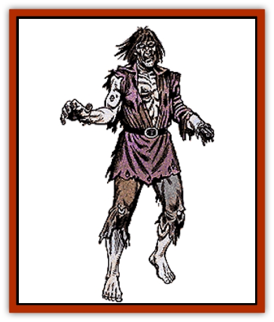

# Zombie

| Statistic | **Common** | **Ju-ju** | **Lord** | **Monster** | **Sea** |
| --- | --- | --- | --- | --- | --- |
| **Activity Cycle:** | Night | Night | Night | Night | Night |
| **Alignment:** | Neutral | Neutral evil | Neutral evil | Neutral | Chaotic evil |
| **Armor Class:** | 8 | 6 | 6 | 6 | 7 |
| **Climate/Terrain:** | Any | Any | Any | Any | Shallow water |
| **Damage/Attack:** | 1-8 | 3-12 | 2-8/2-8 | 4-16 | 1-10 |
| **Diet:** | None | None | Carrion | None | Scavenger |
| **Frequency:** | Rare | Very rare | Very rare | Very rare | Rare |
| **Hit Dice:** | 2 | 3+12 | 6 | 6 | 5 |
| **Intelligence:** | Non- (0) | Low (5-7) | Average (8-10) | Non- (0) | Low (5-7) |
| **Magic Resistance:** | See below | See below | Nil | See below | Nil |
| **Morale:** | Special | Special | Average (8-10) | Special | Fearless (19-20) |
| **Movement:** | 6 | 9 | 6 | 9 | 6, Sw 12 |
| **No. Appearing:** | 3-24 | 1-4 | 1 | 1-6 | 2-24 |
| **No. of Attacks:** | 1 | 1 | 2 | 1 | 1 |
| **Organization:** | None | None | Solitary | None | Pack |
| **Size:** | M (6') | M (6') | M (6') | L (8-12') | M (6') |
| **Special Attacks:** | Nil | See below | See below | Nil | Stench, disease, spell use |
| **Special Defenses:** | Spell immunity | Spell immunity | Spell immunity | Spell immunity | Spell immunity |
| **THAC0:** | 19 | 15 | 15 | 15 | 15 |
| **Treasure:** | Nil | Nil | A | Nil | M |
| **XP Value:** | 65 | 975 | 650 | 650 | 420 |

Zombies are mindless, animated corpses controlled by their creators, usually evil wizards or priests.

The condition of the corpse is not changed by the animating spell. If the body was missing a limb, the zombie created from it would be missing the same limb. Since it is difficult to get fresh bodies, most zombies are in sorry shape, usually missing hair and flesh, and sometimes even bones. This affects their movement, making it jerky and uneven. Usually zombies wear the clothing they died (or were buried) in. The rotting stench from a zombie might be noticeable up to 100 feet away, depending upon the condition of the body. Zombies cannot talk, being mindless, but have been known to utter a low moan when unable to complete an assigned task.

**Combat:** Zombies move very slowly, always striking last in a combat round. They are given only simple, single-phrase commands. They always fight until called off or destroyed, and nothing short of a priest can turn them back. They move in a straight line toward their opponents, with arms outstretched, seeking to claw or pummel their victims to death. Like most undead, zombies are immune to *sleep*, *charm*, *hold*, death magic, poisons, and cold-based spells. A vial of holy water inflicts 2-8 points of damage to a zombie.

**Habitat/Society:** Zombies are typically found near graveyards, dungeons, and similar charnel places. They follow the spoken commands of their creator, as given on the spot or previously, of limited length and uncomplicated meaning (a dozen simple words or so). The dead body of any humanoid creature can be made into a zombie.

**Ecology:** Zombies are not natural creations and have no role in ecology or nature.

**Ju-Ju Zombie**

These creatures are made when a wizard drains the life force from a man-sized humanoid creature with an *energy drain* spell. Their skin is hard, gray, and leathery. Ju-ju zombies have a spark of intelligence. A hateful light burns in their eyes, as they realize their condition and wish to destroy living things. They understand full-sentence instructions with conditions, and use simple tactics and strategies. Since they became zombies at the moment of death, their bodies tend to be in better condition. Ju-ju zombies use normal initiative rules to determine when they strike. They are dexterous enough to use normal weapons, although they must be specifically commanded to do so. These zombies can hurl weapons like javelins or spears, and can fire bows and crossbows. Their Dexterity allows them to climb walls as a thief (92%) and they strike as a 6 Hit Die monster. Ju-ju zombies are turned as specters.

The animating force of a ju-ju zombie is more strongly tied to the Negative Material plane. The result is that only +1 or better magical weapons can harm them. Regardless of the magic on the weapon, edged and cleaving weapons inflict normal damage, while blunt and piercing weapons cause half damage. In addition to normal zombie spell immunities, ju-ju zombies are immune to mind affecting spells and psionics, illusions, and to electricity and *magic missiles*. Fire causes only half damage.

**Zombie Lord**

The [[Zombie_Lord|zombie lord]] is a living creature that has taken on the foul powers and abilities of the undead. They are formed on rare occasions as the result of a *raise dead* spell gone awry. Zombie lords look as they did in life, save that their skin has turned to the pale grey of death, and their flesh is rotting and decaying. The odor of vile corruption and rotting meat hangs about them, and carrion feeding insects often buzz about them to dine on the bits of flesh and ichor that drop from their bodies.

The zombie lords can speak those languages they knew in life and they seem to have a telepathic or mystical ability to converse freely with the living dead. Further, they can *speak with dead* merely by touching a corpse. Zombie lords are turned as vampires.

When forced into combat, it relies on the great strength of its two crushing fists. The odor of death surrounding the zombie lord is so potent it causes horrible effects in those who breathe it. On the first round a character comes within 30 yards, he must save vs. poison or be affected in some way. The following results are possible:

| 1d6 Roll | Effect |
| --- | --- |
| 1 | Weakness (as the spell). |
| 2 | Cause disease (as the spell). |
| 3 | -1 point of Constitution. |
| 4 | Contagion (as the spell). |
| 5 | Character unable to act for 1d4 rounds due to nausea and vomiting. |
| 6 | Character dies instantly and becomes a zombie under control of the zombie lord. |

All zombies within sight of the zombie lord are subject to its mental instructions. Further, the creature can use the senses of any zombie within a mile of it to learn all that is happening within a very large area.

Once per day, the zombie lord can *animate dead* to transform dead creatures into zombies. This works as described in the *Player's Handbook* except that it can be used on the living. Any living creature with fewer Hit Dice than the zombie lord can be attacked in this manner. A target who fails a saving throw vs. death is slain. In 1d4 rounds, the slain creature rises as a zombie under the zombie lord's command.

Zombie lords seek out places of death as lairs. Often, they live in old graveyards or on the site of a tremendous battle - any place there may be bodies to animate and feast upon. The mind of the zombie lord tends to focus on death and the creation of more undead. The regions around their lairs are often littered with the decaying bodies, half eaten, of those who have tried to confront the foul beast.

The zombie lord comes into being by chance, and only under certain conditions. First, an evil human must die at the hand of an undead creatures. Second, an attempt to raise the character must be made. Third, the corpse must fail its resurrection survival roll. Fourth and last, a deity of evil must show "favor" to the deceased, and curse him or her with the "gift of eternal life". Within one week of the raise attempt, the corpse awakens as a zombie lord.

**Sea Zombie**

[[Zombie_Sea|Sea zombies]] (also known as drowned ones) are the animated corpses of humans who died at sea. Although similar to land-dwelling zombies, they are free-willed and are rumored to be animated by the will of the god Nerull the Reaper (or another similar evil deity).

The appearance of drowned ones matches their name: they look like human corpses that have been underwater for some time; bloated and discolored flesh dripping with foul water, empty eye-sockets, tongue frequently protruding from between blackened lips. Their visage and the stench of decay surrounding them are so disgusting that anyone seeing a drowned one or coming within 20 feet of one must roll a saving throw vs. poison. A failed saving throw indicates that the character is nauseated, suffering a -1 penalty to his attack roll and a +1 penalty to his AC for 2d4 rounds. On land, drowned ones move slowly, with a clumsy, shambling gait. In water, however, they can swim with frightening speed.

Drowned ones have an abiding hatred for the living and attack them at any opportunity. These attacks often show surprising cunning (for example, luring ships onto the rocks and attacking the sailors as they try to save themselves from the wreck). Drowned ones take advantage of their swimming speed by attacking ships as they lie at anchor - climbing aboard the vessel and trying to drive the sailors overboard, where they can deal with them more easily.

Drowned ones attack with the weapons typical of sailors: short swords, daggers, hooks, clubs, belaying pins, etc. Because of the unnatural strength of the creatures, these weapons all inflict 1d10 points of damage. The putrid water that drips from the drowned ones contains many bacteria, so any successful hit has a 10% chance of causing a severe disease in the victim. The water-logged condition of the creature's flesh means that fire and fire-based magic cause only half damage. Lightning, electrical, and cold-based attacks inflict double damage. Drowned ones are immune to *sleep*, *charm* spells, illusions, and other mind-altering spells. Because they are created by the direct will of a deity, they cannot be turned.

Many of the humans who become drowned ones were priests while alive, and they retain their powers as undead. There is a 50% chance that each drowned one encountered is a priest of level 1d4. These creatures are granted their spells directly from Nerull (or similar deity), receiving only baneful spells.

Drowned ones congregate in loose packs. Their only motivation is their hatred for the living. They have no need to eat, although they rend and chew the flesh of their prey (this is probably just to strike terror in others). Underwater, drowned ones are active around the clock and are often found in the sunken wrecks of the ships in which they drowned. They are active above the surface during the night. Drowned ones normally stray no more than 100 yards from the water. If the wind drives the fog onto the coast, however, they can roam inland as far as the fog reaches. When the fog retreats, or when the sun is about to rise, they must return to the water.

---
## Discovery & Documentation

**Source Publication:** MC1 Volume I (w/binder #1) (1991)
**Campaign Setting:** Advanced Dungeons & Dragons 2nd Edition
**Author(s):** Jay Batista, Scott Bennie, Grant Boucher, William W. Connors, Steve Gilbert, Heike Kubasch, James Lowder, David Edward Martin, Bruce Nesmith, Jean Rabe, Rick Swan, John J. Terra, Gary L. Thomas

### Other Creatures Found in This Source Book
   * [[Bat|Bat]]
   * [[Bear|Bear]]
   * [[Behir|Behir]]
   * [[Boar|Boar]]
   * [[Bookworm|Bookworm]]
   * [[Brownie|Brownie]]
   * [[Bugbear|Bugbear]]
   * [[Carrion_Crawler|Carrion Crawler]]
   * [[Cat_Great|Cat, Great]]
   * [[Catoblepas|Catoblepas]]
   * [[Dragon_General_Information|Dragon, General Information]]
   * [[Dragonfish|Dragonfish]]
   * [[Elemental_Air_Kin_Aerial_Servant|Elemental, Air Kin, Aerial Servant]]
   * [[Elemental_Earth_Kin_Sandling|Elemental, Earth Kin, Sandling]]
   * [[Elephant|Elephant]]
   * [[Gnoll|Gnoll]]
   * [[Hobgoblin|Hobgoblin]]
   * [[Homunculus|Homunculus]]
   * [[Hornet_Giant|Hornet, Giant]]
   * [[Horse|Horse]]
   * [[Hyena|Hyena]]
   * [[Jackal|Jackal]]
   * [[Jackalwere|Jackalwere]]
   * [[Korred|Korred]]
   * [[Lich|Lich]]
   * [[Lizard|Lizard]]
   * [[Lizard_Man|Lizard Man]]
   * [[Lycanthrope_General_Information|Lycanthrope, General Information]]
   * [[Lycanthrope_Seawolf|Lycanthrope, Seawolf]]
   * [[Lycanthrope_Werebear|Lycanthrope, Werebear]]
   * [[Lycanthrope_Weretiger|Lycanthrope, Weretiger]]
   * [[Lycanthrope_Werewolf|Lycanthrope, Werewolf]]
   * [[Manticore|Manticore]]
   * [[Medusa|Medusa]]
   * [[Mind_Flayer|Mind Flayer]]
   * [[Minotaur|Minotaur]]
   * [[Mudman|Mudman]]
   * [[Mummy|Mummy]]
   * [[Nixie|Nixie]]
   * [[Nymph|Nymph]]
   * [[Ogre|Ogre]]
   * [[Ooze_Slime_Jelly_I|Ooze/Slime/Jelly I]]
   * [[Ooze_Slime_Jelly_II|Ooze/Slime/Jelly II]]
   * [[Orc|Orc]]
   * [[Owl|Owl]]
   * [[Owlbear_I|Owlbear I]]
   * [[Pegasus|Pegasus]]
   * [[Piercer|Piercer]]
   * [[Pudding_Deadly|Pudding, Deadly]]
   * [[Rakshasa|Rakshasa]]
   * [[Rat|Rat]]
   * [[Ray|Ray]]
   * [[Remorhaz|Remorhaz]]
   * [[Satyr|Satyr]]
   * [[Scorpion|Scorpion]]
   * [[Selkie|Selkie]]
   * [[Shadow|Shadow]]
   * [[Skeleton|Skeleton]]
   * [[Skunk|Skunk]]
   * [[Snake|Snake]]
   * [[Spectre|Spectre]]
   * [[Spider|Spider]]
   * [[Sprite|Sprite]]
   * [[Toad_Giant|Toad, Giant]]
   * [[Treant|Treant]]
   * [[Troll|Troll]]
   * [[Umber_Hulk|Umber Hulk]]
   * [[Unicorn|Unicorn]]
   * [[Vampire|Vampire]]
   * [[Wight|Wight]]
   * [[Will_O'Wisp|Will O'Wisp]]
   * [[Wolf|Wolf]]
   * [[Wolfwere|Wolfwere]]
   * [[Wraith|Wraith]]
   * [[Wyvern|Wyvern]]
   * [[Yeti|Yeti]]
   * [[Yuan-ti|Yuan-ti]]
