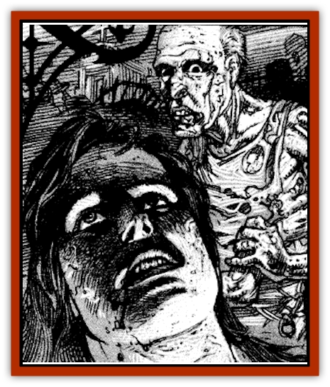

# Zombie - Cannibal

| Statistic | **Zombie, Cannibal** |
| --- | --- |
| **Activity Cycle:** | Night |
| **Alignment:** | Chaotic evil |
| **Armor Class:** | 7 |
| **Climate/Terrain:** | Ravenloft |
| **Damage/Attack:** | 1-8 or 1-2 |
| **Diet:** | Carnivore |
| **Frequency:** | Very rare |
| **Hit Dice:** | 2+2 |
| **Intelligence:** | Low (5-7) |
| **Magic Resistance:** | Nil |
| **Morale:** | Steady (11-12) |
| **Movement:** | 6 |
| **No. Appearing:** | 2-20 (2d10) |
| **No. of Attacks:** | 1 |
| **Organization:** | Pack |
| **Size:** | M (6' tall) |
| **Special Attacks:** | Poison |
| **Special Defenses:** | Immune to <i>sleep</i>, <i>charm</i>, <i>hold</i> and poison |
| **THAC0:** | 19 |
| **Treasure:** | Nil |
| **XP Value:** | 270 |

Cannibal [[Zombie|zombies]] shuffle through their morbid existence somewhere on the brink between the world of the living and the dark realm of the dead. These foul creatures wander about, killing many innocents and creating still more of their dread kind from victims not fortunate enough to die in their initial attack.

Cannibals appear fresher and more alive than true zombies. Still, such creatures look exceptionally haggard, with staring eyes, slack features, and ichor-dripping wounds. Their expressions only change when they actually attack, at which time they slaver and moan horribly as they claw greedily at their next meal. Cannibal zombies care nothing for clothing, and are thus most commonly dressed in fetid rags. The stench that surrounds them is a nauseating combination of rotten meat and dried blood that is noticeable up to 50 feet distant.

These pitiful creatures retain a marginal ability to communicate in the languages they knew in life. Most frequently, however, they do not pause to speak but shuffle on seeking new flesh to devour. A *speak with dead* spell or similar enchantment can force them to pause for a moment and engage in conversation. As soon as the spell lapses, however, the creature reverts to its ravenous nature.

**Combat:** Packs of cannibal zombies shuffle about at night in a constant search for living humans and demihumans, their preferred source of food. Most often such a pack will converge on a small household or farmstead, hammering at doors and smashing in windows, heedless of any damage done to themselves.

Once they have chosen a target, the zombies will not relent unless turned (treat as [[Ghoul|ghouls]] for this) or held off until sunrise. At dawn, the group will turn away with despairing moans, sometimes turning on one of their own to assuage their terrible hunger for flesh. There is, however, a 50% chance the group will return to the same household on the following evening. This remains true each evening the pack is repelled, until the zombies either succeed or change targets.

Once within range of a victim, cannibal zombies attack mindlessly, never winning initiative and thus always attacking at the end of the round. Zombies may either claw at their foes, doing 1-8 points of damage, or attempt to bite their opponents for 1-2 points of damage.

Anyone bitten by a cannibal zombie must make a saving throw vs. poison. Success indicates that the creature's poisonous saliva has had no effect. Failure means that the victim will soon become a new cannibal zombie himself unless a *cure disease* spell is cast upon him quickly. Within 2-8 (2d4) rounds after failing the saving throw the victim begins to feel a gnawing hunger. Every other round thereafter the victim must make a Constitution check. When this check fails, the victim is killed by the fast-acting poison in his veins and moves to join his new brethren in attacking the fully living. Once this happens, a *cure disease* spell will have no effect on the new zombie. A *slow poison* spell will retard the poison's onset, but this only delays the inevitable.

Cannibal zombies are immune to *sleep*, *charm*, *hold*, and all poisons. Holy water does 1-6 points of damage per flask to the monsters.

**Habitat/Society:** Cannibal zombies have only the most tenuous form of society. They make their homes within ruins, abandoned mausoleums, or wherever they found their last meal. Although they travel in packs, it seems this is more for convenience than for companionship, since the monsters simply fall upon each other when they cannot find sufficient living fodder. In a sense, creating more such zombies is simply a way of ensuring enough available food sources, for if a cannibal zombie does not taste flesh for three nights running, its own body will turn on itself, and the zombie will crumple into an unliving husk.

[[Zombie_Lord|Zombie lords]] are able to communicate with cannibal zombies. Such lords often bribe these creatures with the promise of living flesh in return for aid in overrunning a village. This system works especially well for the zombie lord who can transform any cannibal zombies killed during the fighting into true zombies that will do the nefarious creature's bidding.

**Ecology:** It is not known how cannibal zombies first came into existence. It is certain, however, that such monstrosities have little to do with the natural order, although they will occasionally take part in the food chain as scavengers, feeding on carrion.

---
## Discovery & Documentation

**Source Publication:** Ravenloft Appendix III (1991)
**Campaign Setting:** Ravenloft
**Author(s):** Kirk Botulla

### Other Creatures Found in This Source Book
   * [[Akikage|Akikage]]
   * [[Animator_Common|Animator, Common]]
   * [[Animator_Greater|Animator, Greater]]
   * [[Animator_Minor|Animator, Minor]]
   * [[Animator_General_Information|Animator, General Information]]
   * [[Bakhna_Rakhna|Bakhna Rakhna]]
   * [[Baobhan_Sith|Baobhan Sith]]
   * [[Beetle_Scarab|Beetle, Scarab]]
   * [[Boneless|Boneless]]
   * [[Boowray|Boowray]]
   * [[Bruja|Bruja]]
   * [[Carrionette|Carrionette]]
   * [[Carrion_Stalker|Carrion Stalker]]
   * [[Cat_Midnight|Cat, Midnight]]
   * [[Cat_Skeletal|Cat, Skeletal]]
   * [[Cloaker_Resplendent|Cloaker, Resplendent]]
   * [[Cloaker_Shadow|Cloaker, Shadow]]
   * [[Cloaker_Undead|Cloaker, Undead]]
   * [[Corpse_Candle|Corpse Candle]]
   * [[Death's_Head_Tree|Death's Head Tree]]
   * [[Doppelganger_Ravenloft|Doppelganger (Ravenloft)]]
   * [[Familiar_Pseudo-|Familiar, Pseudo-]]
   * [[Familiar_Undead|Familiar, Undead]]
   * [[Feathered_Serpent|Feathered Serpent]]
   * [[Fenhound|Fenhound]]
   * [[Figurine_Ceramic|Figurine, Ceramic]]
   * [[Figurine_Crystal|Figurine, Crystal]]
   * [[Figurine_Ivory|Figurine, Ivory]]
   * [[Figurine_Obsidian|Figurine, Obsidian]]
   * [[Figurine_Porcelain|Figurine, Porcelain]]
   * [[Figurine_General_Information|Figurine, General Information]]
   * [[Fleas_of_Madness|Fleas of Madness]]
   * [[Furies|Furies]]
   * [[Geist|Geist]]
   * [[Ghost_Animal|Ghost, Animal]]
   * [[Golem_Flesh_Ravenloft|Golem, Flesh (Ravenloft)]]
   * [[Golem_Mist_Ravenloft|Golem, Mist (Ravenloft)]]
   * [[Golem_Wax_Ravenloft|Golem, Wax (Ravenloft)]]
   * [[Gremishka|Gremishka]]
   * [[Hag_Spectral|Hag, Spectral]]
   * [[Head_Hunter|Head Hunter]]
   * [[Hearth_Fiend|Hearth Fiend]]
   * [[Hebi-No-Onna|Hebi-No-Onna]]
   * [[Hound_Phantom|Hound, Phantom]]
   * [[Hound_Skeletal|Hound, Skeletal]]
   * [[Imp_Wishing|Imp, Wishing]]
   * [[Ivy_Crawling|Ivy, Crawling]]
   * [[Jack_Frost|Jack Frost]]
   * [[Jolly_Roger|Jolly Roger]]
   * [[Kizoku|Kizoku]]
   * [[Lashweed|Lashweed]]
   * [[Leech_Magical|Leech, Magical]]
   * [[Leech_Psionic|Leech, Psionic]]
   * [[Lich_Defiler|Lich, Defiler]]
   * [[Lich_Drow|Lich, Drow]]
   * [[Lich_Elemental|Lich, Elemental]]
   * [[Lich_Psionic|Lich, Psionic]]
   * [[Living_Tattoo|Living Tattoo]]
   * [[Lycanthrope_Loup-garou|Lycanthrope, Loup-garou]]
   * [[Lycanthrope_Werejackal|Lycanthrope, Werejackal]]
   * [[Lycanthrope_Werejaguar_Ravenloft|Lycanthrope, Werejaguar (Ravenloft)]]
   * [[Lycanthrope_Wereleopard|Lycanthrope, Wereleopard]]
   * [[Lycanthrope_Wereray|Lycanthrope, Wereray]]
   * [[Mist_Ferryman|Mist Ferryman]]
   * [[Moor_Man|Moor Man]]
   * [[Obedient|Obedient]]
   * [[Odem|Odem]]
   * [[Paka|Paka]]
   * [[Plant_Blood_Rose|Plant, Blood Rose]]
   * [[Plant_Fearweed|Plant, Fearweed]]
   * [[Radiant_Spirit|Radiant Spirit]]
   * [[Recluse|Recluse]]
   * [[Remnant_Aquatic|Remnant, Aquatic]]
   * [[Rushlight|Rushlight]]
   * [[Sea_Spawn_Master|Sea Spawn, Master]]
   * [[Sea_Spawn_Minion|Sea Spawn, Minion]]
   * [[Shadow_Asp|Shadow Asp]]
   * [[Shattered_Brethren|Shattered Brethren]]
   * [[Skeleton_Archer|Skeleton, Archer]]
   * [[Skeleton_Insectoid|Skeleton, Insectoid]]
   * [[Skin_Thief|Skin Thief]]
   * [[Spirit_Psionic|Spirit, Psionic]]
   * [[Strahd_Skeleton|Strahd Skeleton]]
   * [[Strahd_Zombie|Strahd Zombie]]
   * [[Unicorn_Shadow|Unicorn, Shadow]]
   * [[Vampire_Drow|Vampire, Drow]]
   * [[Vampire_Nosferatu|Vampire, Nosferatu]]
   * [[Vampire_Oriental|Vampire, Oriental]]
   * [[Virus_General_Information|Virus, General Information]]
   * [[Virus_I|Virus I]]
   * [[Virus_II|Virus II]]
   * [[Virus_III|Virus III]]
   * [[Vorlog|Vorlog]]
   * [[Will_O'Dawn|Will O'Dawn]]
   * [[Will_O'Deep|Will O'Deep]]
   * [[Will_O'Mist|Will O'Mist]]
   * [[Will_O'Sea|Will O'Sea]]
   * [[Zombie_Desert|Zombie, Desert]]
   * [[Zombie_Wolf|Zombie Wolf]]
   * [[Zombie_Fog|Zombie Fog]]
