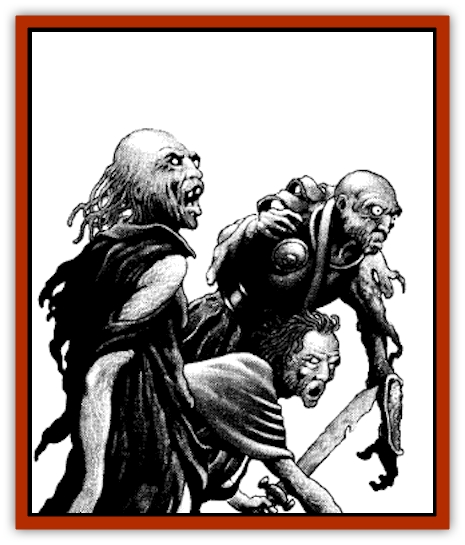

# Zombie - Desert

| Statistic | **Zombie, Desert** |
| --- | --- |
| **Activity Cycle:** | Night |
| **Alignment:** | Neutral |
| **Armor Class:** | 7 |
| **Climate/Terrain:** | Har'Akir |
| **Damage/Attack:** | 1d8 |
| **Diet:** | None |
| **Frequency:** | Very rare |
| **Hit Dice:** | 2 |
| **Intelligence:** | Non- (0) |
| **Magic Resistance:** | Nil |
| **Morale:** | Fearless (19-20) |
| **Movement:** | 9, Br 6 |
| **No. Appearing:** | 3d6 |
| **No. of Attacks:** | 1 |
| **Organization:** | Pack |
| **Size:** | M (5' tall) |
| **Special Attacks:** | Surprise, grab |
| **Special Defenses:** | See below |
| **THAC0:** | 19 |
| **Treasure:** | Nil |
| **XP Value:** | 120 |

Desert [[Zombie|zombies]] are animated corpses controlled by their creator, the evil [[Mummy|mummy]] [[Mummy_Greater_Senmet|Senmet]]. In recent years, rumors have arisen that other powerful spellcasters in the domain of Har'Akir have begun to create these things, but this has yet to be proven.

A desert zombie looks like a dried-out human corpse. Unlike that of common zombies, the desiccated flesh is usually intact and does not deteriorate over time. They have brown, withered skin that clings to their bones. There is very little odor associated with desert zombies. They wear the tattered remains of whatever clothing they had on when they died. Because this clothing is subject to the ravages of time, older desert zombies may not have any garments remaining intact. Like the common zombie, they still bear whatever wounds they had in life, as well as any wounds from battles since they became zombies. Any weapons or equipment is retained, but no attempt is made to maintain it. If the zombie died holding a sword, it carries it until the weapon falls apart or rusts away.

Desert zombies have no more ability to communicate than their common peers. They are able to understand the commands of their master, but these must be limited and very direct or confusion may result.

**Combat:** Desert zombies move with the same halting steps as the common variety. However, they are not as slow and do not suffer the initiative penalties of normal zombies. Desert zombies roll for initiative normally. They always do the same amount of damage (1d8) regardless of the weapon they hold, or even if they are unarmed. They can be directed to use magical weapons and get any of the benefits that might be associated with them.

Like most undead, desert zombies are immune to *sleep*, *charm*, *hold*, death magic, poisons, cold (including spells), and heat (but not actual fire). The sight of a desert zombie is enough to cause a character to make a horror check. Like most situations that call for horror checks in Ravenloft, constant exposure to them makes the characters less susceptible to the horror of their existence. Thus, DMs may wish to grant experienced characters a bonus or even eliminated the need for them to make these checks.

Desert zombies can "swim" through sand. If they are close to the surface, only a few feet under, they leave furrows, like the wake of a boat on water. It can be a terrifying experience to be all alone in the desert and surrounded by unknown creatures swimming under the desert sands.

A desert zombie can reach up through the sand and grab the legs of a victim. They make a normal attack roll for the grab. The target must defend as Armor Class 10, but does get to add his Dexterity bonuses. Once held, the character has -2 penalties to his THAC0 and Armor Class.

Once grabbed, a victim will gradually be pulled beneath the desert sands. It takes three rounds for the zombie to drag the character under the sand. Each round, the character can make a Strength check to break the hold. Once under the sand, the character can survive for one round, but suffocates at the end of the second round.

Senmet directs all of the activities of the desert zombies. He can see and hear through them and control them all each round without impeding his own ability to move or attack during that round. He cannot make the zombies talk, nor are they able to pick up and use weapons or other items near them.

There are two basic strategies Senmet uses with his zombies. He has them bury themselves just under the surface of the desert where they can't be detected. When the intended victims walk over them, the zombies grab their feet and legs. Those not immediately under a character spring up out of the sand and surround the victim.

**Habitat/Society:** These unnatural creatures have no true society and are only an extension of their master's power. They must always be within 8 miles of Senmet. When he doesn't need them, Senmet has the zombies scatter throughout the desert and bury themselves in at least a dozen feet of sand. There they remain until they are needed once again.

**Ecology:** The [[Mummy_Greater|greater mummy]], Senmet, created the first desert zombies. He sacrificed all of his spell casting power to be able to create and control an army of these nightmares, as well as to take limited control over the domain of Har'Akir.

Any character who dies from the disease transmitted by the touch of the greater mummy becomes a desert zombie. It takes a full day after death for the corpse to animate. If the body is destroyed during that time, it will not be animated.

---
## Discovery & Documentation

**Source Publication:** Ravenloft Appendix III (1991)
**Campaign Setting:** Ravenloft
**Author(s):** Kirk Botulla

### Other Creatures Found in This Source Book
   * [[Akikage|Akikage]]
   * [[Animator_Common|Animator, Common]]
   * [[Animator_Greater|Animator, Greater]]
   * [[Animator_Minor|Animator, Minor]]
   * [[Animator_General_Information|Animator, General Information]]
   * [[Bakhna_Rakhna|Bakhna Rakhna]]
   * [[Baobhan_Sith|Baobhan Sith]]
   * [[Beetle_Scarab|Beetle, Scarab]]
   * [[Boneless|Boneless]]
   * [[Boowray|Boowray]]
   * [[Bruja|Bruja]]
   * [[Carrionette|Carrionette]]
   * [[Carrion_Stalker|Carrion Stalker]]
   * [[Cat_Midnight|Cat, Midnight]]
   * [[Cat_Skeletal|Cat, Skeletal]]
   * [[Cloaker_Resplendent|Cloaker, Resplendent]]
   * [[Cloaker_Shadow|Cloaker, Shadow]]
   * [[Cloaker_Undead|Cloaker, Undead]]
   * [[Corpse_Candle|Corpse Candle]]
   * [[Death's_Head_Tree|Death's Head Tree]]
   * [[Doppelganger_Ravenloft|Doppelganger (Ravenloft)]]
   * [[Familiar_Pseudo-|Familiar, Pseudo-]]
   * [[Familiar_Undead|Familiar, Undead]]
   * [[Feathered_Serpent|Feathered Serpent]]
   * [[Fenhound|Fenhound]]
   * [[Figurine_Ceramic|Figurine, Ceramic]]
   * [[Figurine_Crystal|Figurine, Crystal]]
   * [[Figurine_Ivory|Figurine, Ivory]]
   * [[Figurine_Obsidian|Figurine, Obsidian]]
   * [[Figurine_Porcelain|Figurine, Porcelain]]
   * [[Figurine_General_Information|Figurine, General Information]]
   * [[Fleas_of_Madness|Fleas of Madness]]
   * [[Furies|Furies]]
   * [[Geist|Geist]]
   * [[Ghost_Animal|Ghost, Animal]]
   * [[Golem_Flesh_Ravenloft|Golem, Flesh (Ravenloft)]]
   * [[Golem_Mist_Ravenloft|Golem, Mist (Ravenloft)]]
   * [[Golem_Wax_Ravenloft|Golem, Wax (Ravenloft)]]
   * [[Gremishka|Gremishka]]
   * [[Hag_Spectral|Hag, Spectral]]
   * [[Head_Hunter|Head Hunter]]
   * [[Hearth_Fiend|Hearth Fiend]]
   * [[Hebi-No-Onna|Hebi-No-Onna]]
   * [[Hound_Phantom|Hound, Phantom]]
   * [[Hound_Skeletal|Hound, Skeletal]]
   * [[Imp_Wishing|Imp, Wishing]]
   * [[Ivy_Crawling|Ivy, Crawling]]
   * [[Jack_Frost|Jack Frost]]
   * [[Jolly_Roger|Jolly Roger]]
   * [[Kizoku|Kizoku]]
   * [[Lashweed|Lashweed]]
   * [[Leech_Magical|Leech, Magical]]
   * [[Leech_Psionic|Leech, Psionic]]
   * [[Lich_Defiler|Lich, Defiler]]
   * [[Lich_Drow|Lich, Drow]]
   * [[Lich_Elemental|Lich, Elemental]]
   * [[Lich_Psionic|Lich, Psionic]]
   * [[Living_Tattoo|Living Tattoo]]
   * [[Lycanthrope_Loup-garou|Lycanthrope, Loup-garou]]
   * [[Lycanthrope_Werejackal|Lycanthrope, Werejackal]]
   * [[Lycanthrope_Werejaguar_Ravenloft|Lycanthrope, Werejaguar (Ravenloft)]]
   * [[Lycanthrope_Wereleopard|Lycanthrope, Wereleopard]]
   * [[Lycanthrope_Wereray|Lycanthrope, Wereray]]
   * [[Mist_Ferryman|Mist Ferryman]]
   * [[Moor_Man|Moor Man]]
   * [[Obedient|Obedient]]
   * [[Odem|Odem]]
   * [[Paka|Paka]]
   * [[Plant_Blood_Rose|Plant, Blood Rose]]
   * [[Plant_Fearweed|Plant, Fearweed]]
   * [[Radiant_Spirit|Radiant Spirit]]
   * [[Recluse|Recluse]]
   * [[Remnant_Aquatic|Remnant, Aquatic]]
   * [[Rushlight|Rushlight]]
   * [[Sea_Spawn_Master|Sea Spawn, Master]]
   * [[Sea_Spawn_Minion|Sea Spawn, Minion]]
   * [[Shadow_Asp|Shadow Asp]]
   * [[Shattered_Brethren|Shattered Brethren]]
   * [[Skeleton_Archer|Skeleton, Archer]]
   * [[Skeleton_Insectoid|Skeleton, Insectoid]]
   * [[Skin_Thief|Skin Thief]]
   * [[Spirit_Psionic|Spirit, Psionic]]
   * [[Strahd_Skeleton|Strahd Skeleton]]
   * [[Strahd_Zombie|Strahd Zombie]]
   * [[Unicorn_Shadow|Unicorn, Shadow]]
   * [[Vampire_Drow|Vampire, Drow]]
   * [[Vampire_Nosferatu|Vampire, Nosferatu]]
   * [[Vampire_Oriental|Vampire, Oriental]]
   * [[Virus_General_Information|Virus, General Information]]
   * [[Virus_I|Virus I]]
   * [[Virus_II|Virus II]]
   * [[Virus_III|Virus III]]
   * [[Vorlog|Vorlog]]
   * [[Will_O'Dawn|Will O'Dawn]]
   * [[Will_O'Deep|Will O'Deep]]
   * [[Will_O'Mist|Will O'Mist]]
   * [[Will_O'Sea|Will O'Sea]]
   * [[Zombie_Cannibal|Zombie, Cannibal]]
   * [[Zombie_Wolf|Zombie Wolf]]
   * [[Zombie_Fog|Zombie Fog]]
