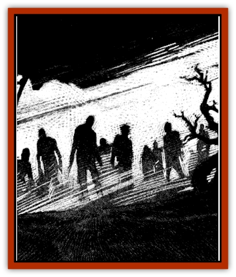

# Zombie Fog

| Statistic | **Cadaver** | **Zombie Fog** |
| --- | --- | --- |
| **Activity Cycle:** | Night | Night |
| **Alignment:** | Neutral | Neutral evil |
| **Armor Class:** | 8 | -1 |
| **Climate/Terrain:** | Ravenloft | Ravenloft |
| **Damage/Attack:** | 1-6 | Special |
| **Diet:** | None | Special |
| **Frequency:** | Very rare | Very rare |
| **Hit Dice:** | 2+2 | 6-10 |
| **Intelligence:** | Non- (0) | Semi- (2-4) |
| **Magic Resistance:** | Nil | Nil |
| **Morale:** | Fearless (19-20) | Champion (15-16) |
| **Movement:** | 6 | 6 |
| **No. Appearing:** | 4d10 | 1 |
| **No. of Attacks:** | 1 | 1 |
| **Organization:** | None | Solitary |
| **Size:** | M (5-6') | G (60-100' cloud) |
| **Special Attacks:** | Nil | <i>Cause despair</i>, control cadavers |
| **Special Defenses:** | Spell immunity, reanimation | +1 or better to hit, spell immunity |
| **THAC0:** | 19 | Varies |
| **Treasure:** | Nil | Nil |
| **XP Value:** | 175 | 6 HD: 1,400 / 7 HD: 2,000 / 8 HD: 2,000 / 9 HD: 3,000 / 10 HD: 4,000 |

The zombie fog is an evil creature that feeds on the psychic energies emitted by living creatures at the moment of their deaths. This malevolent vapor has no physical attacks of its own, relying instead upon the corpses it animates and controls to strike down any living thing that threatens it.

The zombie fog appears as a fairly dense bank of mist. [[Horse|Horses]] and dogs [[Dog|can]] sense the fog's evil nature and will attempt to avoid it at all costs. As a rule, the creature will be 25 feet in diameter for every Hit Die that it possesses. Even more noticeable are the walking corpses, or cadavers, which almost always accompany the fog. These are virtually identical to [[Zombie|zombies]], having the same shuffling gate, slack expressions, and decayed appearance as the undead.

Conventional attempts to communicate with the zombie fog or its cadavers always fail. Magical or psionic attempts that place one in direct mental contact with the creature require a madness check, but otherwise fail utterly.

**Combat:** The zombie fog's sole goal in battle is to engineer the deaths of as many creatures as possible within its trailing expanse. Although the zombie fog has no direct physical attacks, it can control a number of cadavers equal to its current hit points.

A zombie fog may also *cause despair* up to three times per night. When it does this, any living being within its misty tendrils must make a saving throw vs. spell. Anyone failing this roll immediately feels utterly hopeless. The despairing victim will not attack or defend himself until struck by an enemy. The first attack against such a desolate victim gains a +4 bonus to hit. In addition, the victim receives no Dexterity bonuses to his Armor Class. After this first attack, if the victim still lives, he can defend himself, but all attacks against him are made at +2, while the victim makes his attacks with a -2 penalty. Even those successfully saving against the zombie fog's attack receive a -1 on their attack rolls for the duration of the spell, due to their continuing efforts to fight off the magical despair. The despair created by the zombie fog fades away only with the coming of the dawn or the casting of a *dispel magic* on the victim.

Fortunately for the monster's foes, the zombie fog can be hit by magical weapons. Unenchanted weapons, however, do no damage to the creature.

Most magical spells have no effect upon the vaporous body of this abomination. Those that involve the creation of air currents and the like, such as the *gust of wind* spell, can injure the zombie fog, however. As a rule, any spell of this type that is used to attack the creature will inflict 1d4 points of damage per level of the spell. Thus, a 4th level *wind wall* spell would cause 4d4 points of damage to the thing.

**Habitat/Society:** The zombie fog is a barely sentient, nocturnal creature most often found within a day's journey of some large burial ground or other plentiful source of dead bodies. Although the sun's rays do not appear to harm the zombie fog, the misty creature is almost never active before sunset as its power to control cadavers only functions during the night.

**Ecology:** Each week, the zombie fog must feast on the death-energies of at least as many living creatures as it has Hit Dice. If a zombie fog is unable to feed on enough such energy in a given week, the monster will shrink in size or even die. For every week without sufficient "food", the zombie fog loses one Hit Die. Conversely, if a zombie fog feeds on twice as many deaths as necessary in a week, the monster will gain a Hit Die.

The zombie fog is believed to be related to the [[Mist_Horror|mist horror]], but sages are uncertain as to the exact nature of this kinship.

**Cadaver**

  Cadavers are merely dead bodies under the control of a zombie fog. They are not truly undead, and as such cannot be turned. The animating force is the zombie fog, not the negative material plane. Cadavers have no will of their own and instantly obey their animator.

As with zombies, cadavers always attack last in a round. They attack with whatever is at hand, doing 1-6 points of damage per hit. Poison, mind-affecting, *death*, and *hold* spells do not affect cadavers. They can be hit by normal weapons, however cadavers will always rise again in 1-4 rounds after being struck down. Newly risen cadavers are at full hit points. Cadavers can rise again and again. Only the death of the controlling fog or the utter destruction of the body can keep this from happening.

---
## Discovery & Documentation

**Source Publication:** Ravenloft Appendix III (1991)
**Campaign Setting:** Ravenloft
**Author(s):** Kirk Botulla

### Other Creatures Found in This Source Book
   * [[Akikage|Akikage]]
   * [[Animator_Common|Animator, Common]]
   * [[Animator_Greater|Animator, Greater]]
   * [[Animator_Minor|Animator, Minor]]
   * [[Animator_General_Information|Animator, General Information]]
   * [[Bakhna_Rakhna|Bakhna Rakhna]]
   * [[Baobhan_Sith|Baobhan Sith]]
   * [[Beetle_Scarab|Beetle, Scarab]]
   * [[Boneless|Boneless]]
   * [[Boowray|Boowray]]
   * [[Bruja|Bruja]]
   * [[Carrionette|Carrionette]]
   * [[Carrion_Stalker|Carrion Stalker]]
   * [[Cat_Midnight|Cat, Midnight]]
   * [[Cat_Skeletal|Cat, Skeletal]]
   * [[Cloaker_Resplendent|Cloaker, Resplendent]]
   * [[Cloaker_Shadow|Cloaker, Shadow]]
   * [[Cloaker_Undead|Cloaker, Undead]]
   * [[Corpse_Candle|Corpse Candle]]
   * [[Death's_Head_Tree|Death's Head Tree]]
   * [[Doppelganger_Ravenloft|Doppelganger (Ravenloft)]]
   * [[Familiar_Pseudo-|Familiar, Pseudo-]]
   * [[Familiar_Undead|Familiar, Undead]]
   * [[Feathered_Serpent|Feathered Serpent]]
   * [[Fenhound|Fenhound]]
   * [[Figurine_Ceramic|Figurine, Ceramic]]
   * [[Figurine_Crystal|Figurine, Crystal]]
   * [[Figurine_Ivory|Figurine, Ivory]]
   * [[Figurine_Obsidian|Figurine, Obsidian]]
   * [[Figurine_Porcelain|Figurine, Porcelain]]
   * [[Figurine_General_Information|Figurine, General Information]]
   * [[Fleas_of_Madness|Fleas of Madness]]
   * [[Furies|Furies]]
   * [[Geist|Geist]]
   * [[Ghost_Animal|Ghost, Animal]]
   * [[Golem_Flesh_Ravenloft|Golem, Flesh (Ravenloft)]]
   * [[Golem_Mist_Ravenloft|Golem, Mist (Ravenloft)]]
   * [[Golem_Wax_Ravenloft|Golem, Wax (Ravenloft)]]
   * [[Gremishka|Gremishka]]
   * [[Hag_Spectral|Hag, Spectral]]
   * [[Head_Hunter|Head Hunter]]
   * [[Hearth_Fiend|Hearth Fiend]]
   * [[Hebi-No-Onna|Hebi-No-Onna]]
   * [[Hound_Phantom|Hound, Phantom]]
   * [[Hound_Skeletal|Hound, Skeletal]]
   * [[Imp_Wishing|Imp, Wishing]]
   * [[Ivy_Crawling|Ivy, Crawling]]
   * [[Jack_Frost|Jack Frost]]
   * [[Jolly_Roger|Jolly Roger]]
   * [[Kizoku|Kizoku]]
   * [[Lashweed|Lashweed]]
   * [[Leech_Magical|Leech, Magical]]
   * [[Leech_Psionic|Leech, Psionic]]
   * [[Lich_Defiler|Lich, Defiler]]
   * [[Lich_Drow|Lich, Drow]]
   * [[Lich_Elemental|Lich, Elemental]]
   * [[Lich_Psionic|Lich, Psionic]]
   * [[Living_Tattoo|Living Tattoo]]
   * [[Lycanthrope_Loup-garou|Lycanthrope, Loup-garou]]
   * [[Lycanthrope_Werejackal|Lycanthrope, Werejackal]]
   * [[Lycanthrope_Werejaguar_Ravenloft|Lycanthrope, Werejaguar (Ravenloft)]]
   * [[Lycanthrope_Wereleopard|Lycanthrope, Wereleopard]]
   * [[Lycanthrope_Wereray|Lycanthrope, Wereray]]
   * [[Mist_Ferryman|Mist Ferryman]]
   * [[Moor_Man|Moor Man]]
   * [[Obedient|Obedient]]
   * [[Odem|Odem]]
   * [[Paka|Paka]]
   * [[Plant_Blood_Rose|Plant, Blood Rose]]
   * [[Plant_Fearweed|Plant, Fearweed]]
   * [[Radiant_Spirit|Radiant Spirit]]
   * [[Recluse|Recluse]]
   * [[Remnant_Aquatic|Remnant, Aquatic]]
   * [[Rushlight|Rushlight]]
   * [[Sea_Spawn_Master|Sea Spawn, Master]]
   * [[Sea_Spawn_Minion|Sea Spawn, Minion]]
   * [[Shadow_Asp|Shadow Asp]]
   * [[Shattered_Brethren|Shattered Brethren]]
   * [[Skeleton_Archer|Skeleton, Archer]]
   * [[Skeleton_Insectoid|Skeleton, Insectoid]]
   * [[Skin_Thief|Skin Thief]]
   * [[Spirit_Psionic|Spirit, Psionic]]
   * [[Strahd_Skeleton|Strahd Skeleton]]
   * [[Strahd_Zombie|Strahd Zombie]]
   * [[Unicorn_Shadow|Unicorn, Shadow]]
   * [[Vampire_Drow|Vampire, Drow]]
   * [[Vampire_Nosferatu|Vampire, Nosferatu]]
   * [[Vampire_Oriental|Vampire, Oriental]]
   * [[Virus_General_Information|Virus, General Information]]
   * [[Virus_I|Virus I]]
   * [[Virus_II|Virus II]]
   * [[Virus_III|Virus III]]
   * [[Vorlog|Vorlog]]
   * [[Will_O'Dawn|Will O'Dawn]]
   * [[Will_O'Deep|Will O'Deep]]
   * [[Will_O'Mist|Will O'Mist]]
   * [[Will_O'Sea|Will O'Sea]]
   * [[Zombie_Cannibal|Zombie, Cannibal]]
   * [[Zombie_Desert|Zombie, Desert]]
   * [[Zombie_Wolf|Zombie Wolf]]
