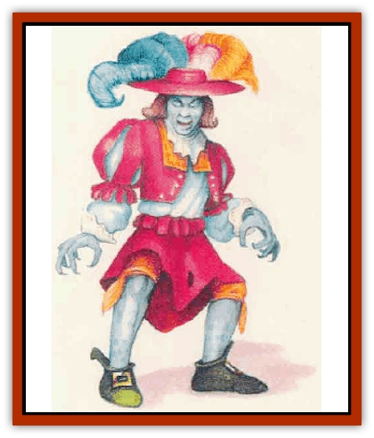

# Zombie - Lightning

| Statistic | **Greater** | **Lesser** |
| --- | --- | --- |
| **Activity Cycle:** | Any | Any |
| **Alignment:** | Chaotic evil | Neutral |
| **Armor Class:** | 6 | 8 |
| **Climate/Terrain:** | Mountains | Mountains |
| **Damage/Attack:** | 1d6 (fist)/1d6 (fist) or by weapon | 1d3 (fist) or by weapon |
| **Diet:** | None | None |
| **Frequency:** | Very rare | Very rare |
| **Hit Dice:** | 4 | 2 |
| **Intelligence:** | Very (11-12) | Very (11-12) |
| **Magic Resistance:** | Nil | Nil |
| **Morale:** | Elite (13) | Elite (13) |
| **Movement:** | 12 | 9 |
| **No. Appearing:** | 1 | 2d6 |
| **No. of Attacks:** | 2 | 1 |
| **Organization:** | Solitary | Solitary |
| **Size:** | M (6' tall) | M (6' tall) |
| **Special Attacks:** | Jolt (2d6) | Jolt (1d6) |
| **Special Defenses:** | Immune to some spells | Immune to some spells |
| **THAC0:** | 17 | 19 |
| **Treasure:** | Q&times;2 | Q |
| **XP Value:** | 420 | 270 |

Lightning [[Zombie|zombies]] are undead creatures created when the bodies of dead humans, demihumans, or humanoids are bathed in exceptionally strong magical auras.

A lightning zombie looks just like a normal member of its race, except that its skin is a uniform light gray. Otherwise, they appear much as they did when alive; they can speak and are often hyperactive in their mannerisms. In darkness they give off a faint glow.

Lightning zombies have a flair for the dramatic. They prefer flashy clothing and jewelry, the more the better.

**Combat:** Since they are undead, lightning zombies are immune to *sleep*, *charm*, and *hold* spells, death magic, and poisons; they are also immune to electrical attacks. Lightning zombies have 60-foot infravision.

When attacking, lightning zombies roll for initiative normally. They can use a weapon or strike with one fist. Their bodies carry a strong electrical charge, and an unarmed lightning zombie can grasp an opponent and deliver a jolt of electricity. To deliver the jolt, the lightning zombie must make a successful hand-to-hand attack and then hold on.

The grasp itself does no damage, but a lightning zombie's hold is very strong, and the victim must make a successful open doors roll to break it. Starting the round after it has taken hold, the lightning zombie can discharge its jolt each round, automatically inflicting 1d6 points of damage. A lightning zombie cannot take other combat actions while using its special attack, however, the zombie can release jolts indefinitely until it decides to let go or its hold is broken.

Lightning zombies are turned as normal zombies, but a successful attempt at turning does not cause them to flee or be destroyed. Instead, the lightning zombie is unable to come closer than 10 feet to the character doing the turning; if already closer than 10 feet, it retreats to that distance. This effect lasts one turn or until the turning character voluntarily breaks the effect by coming within 10 feet of the lightning zombie.

A vial of holy water inflicts 2d4 points of damage if it strikes a lightning zombie.

**Habitat/Society:** Lightning zombies retain no memories or class abilities from their former lives, as the spirits that inhabited them have already departed. Nevertheless, lightning zombies are faintly aware that they once had different identities; most of them remember "waking up" wearing strange clothes. They pick new names for themselves and set about trying to perform mighty deeds of combat and adventure so they can have something to boast about.

**Ecology:** Lightning zombies have no need to eat, drink, or sleep. These qualities make them excellent guards. Unforunately, they yearn for heroic adventure and soon get bored with most tasks. Unless they are destroyed they can live forever, as the magical energies that created them preserve their flesh.

**Greater Lightning Zombie**

  These creatures are created when a powerful character or leader dies and the body is exposed to awesome magical energies. Any lesser lightning zombie created along with it is under the greater lightning zombie's control if it was subordinate to the greater lightning zombie in life. A greater lightning zombie usually has 2d6 lesser lightning zombies attending it.

Greater lightning zombies generally have a thirst for power and seek to extend their dominion over everything they see. They can attack with both fists, and their blows are more potent that a lesser lightning zombie's. Their electrical jolts inflict 2d6 poine of damage.

Greater lightning zombies are turned as shadows. A vial of holy water inflicts 1d4+1 points of damage when it strikes a greater lightning zombie.

---
## Discovery & Documentation

**Source Publication:** Mystara Appendix (1994)
**Campaign Setting:** Mystara
**Author(s):** John Nephew, Teeuwynn Woodruff, John Terra, Skip Williams

### Other Creatures Found in This Source Book
   * [[Actaeon|Actaeon]]
   * [[Agarat|Agarat]]
   * [[Ash_Crawler|Ash Crawler]]
   * [[Baldandar|Baldandar]]
   * [[Bargda|Bargda]]
   * [[Bhut|Bhut]]
   * [[Bird_Mystara|Bird (Mystara)]]
   * [[Blackball|Blackball]]
   * [[Choker|Choker]]
   * [[Coltpixie|Coltpixie]]
   * [[Crone_of_Chaos|Crone of Chaos]]
   * [[Darkhood|Darkhood]]
   * [[Darkwing|Darkwing]]
   * [[Decapus|Decapus]]
   * [[Deep_Glaurant|Deep Glaurant]]
   * [[Diabolus|Diabolus]]
   * [[Dimensional_Warper|Dimensional Warper]]
   * [[Dragon_Mystara_Crystalline|Dragon (Mystara), Crystalline]]
   * [[Dragon_Mystara_Jade|Dragon (Mystara), Jade]]
   * [[Dragon_Mystara_Onyx|Dragon (Mystara), Onyx]]
   * [[Dragon_Mystara_Ruby|Dragon (Mystara), Ruby]]
   * [[Drake_Mystara|Drake (Mystara)]]
   * [[Dragonfly|Dragonfly]]
   * [[Dusanu|Dusanu]]
   * [[Elemental_of_Chaos_Air_Earth|Elemental of Chaos, Air/Earth]]
   * [[Elemental_of_Chaos_Fire_Water|Elemental of Chaos, Fire/Water]]
   * [[Elemental_of_Law_Air_Earth|Elemental of Law, Air/Earth]]
   * [[Elemental_of_Law_Fire_Water|Elemental of Law, Fire/Water]]
   * [[Familiar_Mystara|Familiar (Mystara)]]
   * [[Frost_Salamander|Frost Salamander]]
   * [[Fundamental_Air_Earth|Fundamental, Air/Earth]]
   * [[Fundamental_Fire_Water|Fundamental, Fire/Water]]
   * [[Gargantua_Mystara|Gargantua (Mystara)]]
   * [[Geonid|Geonid]]
   * [[Ghostly_Horde|Ghostly Horde]]
   * [[Giant_Athach|Giant, Athach]]
   * [[Giant_Hephaeston|Giant, Hephaeston]]
   * [[Golem_Drolem|Golem, Drolem]]
   * [[Golem_Mystara_I|Golem (Mystara) I]]
   * [[Golem_Mystara_II|Golem (Mystara) II]]
   * [[Golem_Mystara_III|Golem (Mystara) III]]
   * [[Gray_Philosopher|Gray Philosopher]]
   * [[Guardian_Warrior|Guardian Warrior]]
   * [[Gyerian|Gyerian]]
   * [[Herex|Herex]]
   * [[Hivebrood|Hivebrood]]
   * [[Horde|Horde]]
   * [[Hsiao|Hsiao]]
   * [[Huptzeen|Huptzeen]]
   * [[Hutaakan|Hutaakan]]
   * [[Imp_Mystara|Imp (Mystara)]]
   * [[Jellyfish_Giant_Mystara|Jellyfish, Giant (Mystara)]]
   * [[Kna|Kna]]
   * [[Kopru|Kopru]]
   * [[Lizard_Mystara|Lizard (Mystara)]]
   * [[Lizard-kin_Mystara|Lizard-kin (Mystara)]]
   * [[Lupin|Lupin]]
   * [[Lycanthrope_Werejaguar_Mystara|Lycanthrope, Werejaguar (Mystara)]]
   * [[Lycanthrope_Wereswine|Lycanthrope, Wereswine]]
   * [[Magen|Magen]]
   * [[Manikin|Manikin]]
   * [[Mek|Mek]]
   * [[Mujina|Mujina]]
   * [[Nagpa|Nagpa]]
   * [[Neh-thalggu|Neh-thalggu]]
   * [[Nightshade_Mystara|Nightshade (Mystara)]]
   * [[Nuckalavee|Nuckalavee]]
   * [[Pegataur|Pegataur]]
   * [[Phanaton|Phanaton]]
   * [[Plant_Dangerous_Mystara|Plant, Dangerous (Mystara)]]
   * [[Plasm|Plasm]]
   * [[Rakasta|Rakasta]]
   * [[Rock_Man|Rock Man]]
   * [[Sabreclaw|Sabreclaw]]
   * [[Sacrol|Sacrol]]
   * [[Scamille|Scamille]]
   * [[Shapeshifter|Shapeshifter]]
   * [[Shargugh|Shargugh]]
   * [[Shark-kin|Shark-kin]]
   * [[Sollux|Sollux]]
   * [[Spectral_Death|Spectral Death]]
   * [[Spectral_Hound|Spectral Hound]]
   * [[Spider-kin|Spider-kin]]
   * [[Spirit_Mystara|Spirit (Mystara)]]
   * [[Statue_Living|Statue, Living]]
   * [[Surtaki|Surtaki]]
   * [[Tabi|Tabi]]
   * [[Thoul|Thoul]]
   * [[Thunderhead|Thunderhead]]
   * [[Tiger_Ebon|Tiger, Ebon]]
   * [[Topi|Topi]]
   * [[Tortle|Tortle]]
   * [[Vampire_Velya|Vampire, Velya]]
   * [[White_Fang|White Fang]]
   * [[Worm_Mystara|Worm (Mystara)]]
   * [[Wyrd|Wyrd]]
   * [[Yowler|Yowler]]
