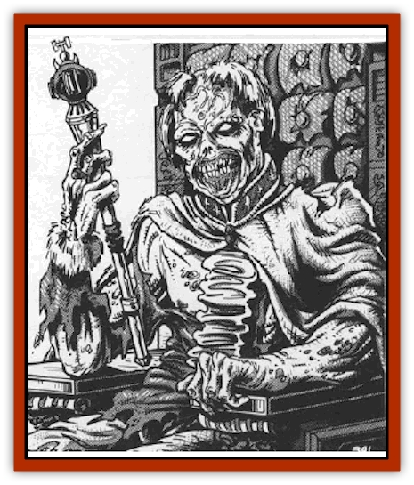

# Zombie Lord

| Statistic | **Zombie Lord** |
| --- | --- |
| **Activity Cycle:** | Night |
| **Alignment:** | Neutral evil |
| **Armor Class:** | 6 |
| **Climate/Terrain:** | Any Ravenloft land |
| **Damage/Attack:** | 2d4/2d4 |
| **Diet:** | Carrion |
| **Frequency:** | Very rare |
| **Hit Dice:** | 6 |
| **Intelligence:** | Average (8-10) |
| **Magic Resistance:** | Nil |
| **Morale:** | Average (8-10) |
| **Movement:** | 6 |
| **No. Appearing:** | 1 |
| **No. of Attacks:** | 2 |
| **Organization:** | Solitary |
| **Size:** | M (6' tall) |
| **Special Attacks:** | See below |
| **Special Defenses:** | See below |
| **THAC0:** | 15 |
| **Treasure:** | A |
| **XP Value:** | 650 |

The [[Zombie|zombie]] lord is a living creature that has taken on the foul powers and abilities of the undead. They are formed on rare occasions as the result of a *raise dead* spell cast while in the demiplane of Ravenloft.

Zombie lords look as they did in life, save that their skin has turned the pale grey of death, and their flesh has begun to rot and decay. The odor of vile corruption and rotting meat hangs about them and carrion-feeding insects often buzz about them to dine on the bits of flesh and ichor that drop from their bodies.

Zombie lords can speak those languages they knew in life and seem to have a telepathic or mystical ability to converse freely with the living dead. Further, they can *speak to dead* merely by touching a corpse. Thus, for them at least, dead men do tell many tales.

**Combat:** When the zombie lord is forced into physical combat, he relies on the great strength of his crushing fists. Striking twice per combat round, the monster inflicts 2d4 points of damage from each blow that finds its mark.

The odor of death that surrounds the zombie lord is so potent that it can cause horrible effects in those who breath it. On the first round that a character comes within 30 yards of the monster, he must save vs. poison or be affected in some way. The following results are possible:

| 1d6 Roll | Effect |
| --- | --- |
| 1 | Weakness (as the spell) |
| 2 | Cause disease (as the spell) |
| 3 | -1 point of Constitution |
| 4 | Contagion (as the spell) |
| 5 | Character unable to act for 1d4 rounds due to nausea and vomiting |
| 6 | Character dies instantly and becomes a zombie under control of the zombie lord |

All zombies within sight of the zombie lord will be subject to its mental instructions. This includes [[Zombie|monster and ju-ju zombies]], but not [[Strahd_Zombie|Strahd]] or [[Yellow_Musk_Creeper|yellow musk creeper zombies]]. Further, the creature can use the senses of any zombie that is within one mile of it and, thus, know all that is happening within a very large area.

Once per day, the zombie lord can use an *animate dead* spell to transform dead creatures into zombies. This works just as described in the *Player's Handbook* except that it can also be used on the living. Any single living creature with fewer Hit Dice than the zombie lord can be attacked in this manner in lieu of the casting of this spell in its normal fashion. A target who fails a saving throw vs. death is instantly slain. In 1d4 combat roundly the slain creature will rise again as a zombie under the foul zombie lord's command.

The zombie lord has the same immunities to spells (*sleep*, *charm*, *hold*, and the like) that normal zombies do. In addition, they suffer the same 2d4 points of damage from contact with holy water or holy symbols. They are turned as vampires, however.

**Habitat/Society:** The zombie lord seeks out places of death as lairs. Often, they will live in old graveyards or on the site of a tremendous battle - anyplace that there are many bodies to animate and feast upon.

The mind of a zombie master tends to focus on death and the creation of more undead. The regions around their lairs are often littered with the decaying bodies, often half eaten, of those who have tried to confront the foul creature. They seldom have grandiose schemes like those often undertaken by [[Vampire_General_Information|vampires]] or [[Lich|liches]], but will frequently plan to take over a small town and turn its entire populace into living corpses.

**Ecology:** The zombie lord comes into being by chance, and only under certain conditions. First, an evil human being (the soon-to-be zombie lord) must die at the hands of an unread creature. Second, an attempt to *raise* the slain character must be made. Third, and last, the character must fail his resurrection survival roll. It is believed that the zombie lord can be created only in Ravenloft, but this is not proven absolutely for they have been encountered in other lands from time to time.

---
## Discovery & Documentation

**Source Publication:** MC10 Ravenloft Appendix I (1989)
**Campaign Setting:** Planescape
**Author(s):** William W. Connors

### Other Creatures Found in This Source Book
   * [[Bastellus|Bastellus]]
   * [[Bat_Ravenloft|Bat (Ravenloft)]]
   * [[Bowlyn|Bowlyn]]
   * [[Broken_One|Broken One]]
   * [[Bussengeist|Bussengeist]]
   * [[Darkling|Darkling]]
   * [[Doom_Guard|Doom Guard]]
   * [[Doppelganger_Plant|Doppelganger Plant]]
   * [[Elemental_Ravenloft|Elemental (Ravenloft)]]
   * [[Ermordenung|Ermordenung]]
   * [[Ghoul_Lord|Ghoul Lord]]
   * [[Goblyn|Goblyn]]
   * [[Golem_III|Golem III]]
   * [[Golem_IV|Golem IV]]
   * [[Golem_Ravenloft|Golem (Ravenloft)]]
   * [[Grim_Reaper|Grim Reaper]]
   * [[Human_Abber_Nomad|Human, Abber Nomad]]
   * [[Human_Ravenloft|Human (Ravenloft)]]
   * [[Imp_Assassin|Imp, Assassin]]
   * [[Impersonator|Impersonator]]
   * [[Lycanthrope_Werebat|Lycanthrope, Werebat]]
   * [[Lycanthrope_Wereraven|Lycanthrope, Wereraven]]
   * [[Mist_Horror|Mist Horror]]
   * [[Mummy_Greater|Mummy, Greater]]
   * [[Quevari|Quevari]]
   * [[Quickwood|Quickwood]]
   * [[Ravenkin|Ravenkin]]
   * [[Reaver|Reaver]]
   * [[Scarecrow_Ravenloft|Scarecrow (Ravenloft)]]
   * [[Shadow_Fiend|Shadow Fiend]]
   * [[Skeleton_Giant|Skeleton, Giant]]
   * [[Strahd's_Skeletal_Steed|Strahd's Skeletal Steed]]
   * [[Treant_Evil|Treant, Evil]]
   * [[Treant_Undead|Treant, Undead]]
   * [[Valpurgeist|Valpurgeist]]
   * [[Vampire_Dwarf|Vampire, Dwarf]]
   * [[Vampire_Elf|Vampire, Elf]]
   * [[Vampire_Gnome|Vampire, Gnome]]
   * [[Vampire_Halfling|Vampire, Halfling]]
   * [[Vampire_General_Information|Vampire, General Information]]
   * [[Vampire_Kender|Vampire, Kender]]
   * [[Vampyre|Vampyre]]
   * [[Widow_Red|Widow, Red]]
   * [[Wolfwere_Greater|Wolfwere, Greater]]
