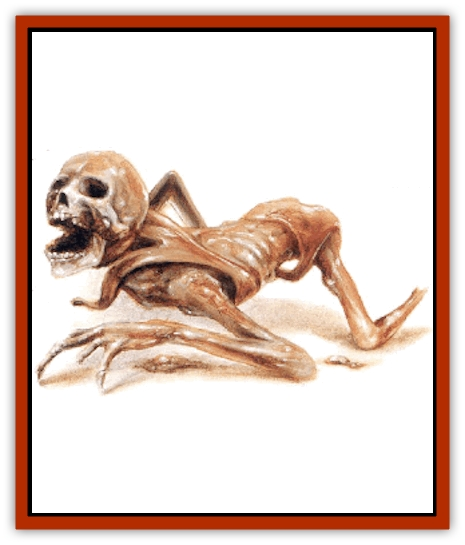
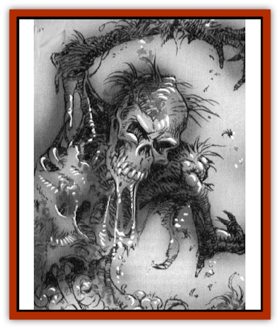

# Zombie - Mud

| Statistic | **Zombie, Mud** |
| --- | --- |
| **Activity Cycle:** | Any |
| **Alignment:** | Neutral evil |
| **Armor Class:** | 8 |
| **Climate/Terrain:** | Darkon wetlands |
| **Damage/Attack:** | 1d6/1d6 (claw/claw) |
| **Diet:** | None |
| **Frequency:** | Very rare |
| **Hit Dice:** | 4 |
| **Intelligence:** | Non- (0) |
| **Magic Resistance:** | Nil |
| **Morale:** | Fearless (20) |
| **Movement:** | 6 |
| **No. Appearing:** | 2d4 |
| **No. of Attacks:** | 1 or 2 |
| **Organization:** | None |
| **Size:** | M (5-6' tall) |
| **Special Attacks:** | Disease, suffocation |
| **Special Defenses:** | Immune to thrusting weapons |
| **THAC0:** | 17 |
| **Treasure:** | Nil |
| **XP Value:** | 650 |

Mud [[Zombie|zombies]] are mindless, animated corpses that consist of a thick layer of slimy mud over a framework of bones. They are the unique creations of Azalin, the [[Lich|lich]] lord of Darkon, and are typically left lying dormant in the place where they were created. When the appropriate condition arises, they become animated. Typically, the trigger is the passage of intruders through the area, at which point these zombies rise up out of the mud and attack the trespassers.

Mud zombies are made from whole or partial skeletons, usually human. If missing a leg, they crawl toward their victims and have only a single claw attack.

**Combat:** Mud zombies move slowly, striking last in any combat round. They fight by clawing at their opponents, using the shattered ends of their bones to inflict ragged wounds. Unless treated with curative spells, holy water, or some other recognized sterilizing process, these wounds fester due to the mud that has been smeared into them. The result is a wound that takes twice as long as usual to heal, plus (unless a successful saving throw vs. poison is made) a mild fever that reduces the victim's Strength by 1 point for 1d6 days. This effect is cumulative to a maximum of 4 lost points of Strength.

If a mud zombie strikes with both hands in a single combat round, it clings fast, pressing the victim's face into its muddy chest. On the next round the victim must roll equal to or under his Strength on 1d20 to break free. If the roll fails, the victim suffers 1d4 points of suffocation damage and is still held. One attempt to break free may be made per combat round.

Mud zombies are fearless and fight until destroyed. When holding a character, the mud zombie pays no attention to any other attacks and is completely focused on suffocating its victim.

Attacks by piercing weapons (sword or knife thrusts, arrows, etc.) do not damage a mud zombie. They merely pass through the mud of its body. The only way to destroy a mud zombie using weapons is to batter it to pieces.

A mud zombie's one weakness is water, which dissolves the mud that makes up its "flesh". A hard, driving rain will wash away a mud zombie's earthen covering in 3d4 combat rounds. Total immersion in water or a direct hit with holy water (which also does 2d4 damage) will likewise cause the mud to slough away, in this case within 1d4 rounds.

When its mud covering disappears, a mud zombie reverts to skeletal form. It has the same hit points as before, but can no longer hold and suffocate a character. The wounds inflicted by it no longer cause disease.

Other useful tactics to employ against a mud zombie include the spell *cone of cold*, which will freeze the mud, stopping the zombie in its tracks for one round. The zombie then breaks free of the frozen mud, emerging on the next round in skeletal form. A reversed *transmute rock to mud* spell will encase the zombie in a shatter-proof stone skin, permanently immobilizing it.

**Habitat/Society:** Mud zombies are typically created wherever the raw materials to make them (bones and mud) are found. Battlefields and graveyards situated near a source of water (a river, bog, or lake) are the usual places where they are encountered. Climatic conditions must be just right. If there has been a prolonged drought, the earth will be dry and hard-packed and it will be impossible for a mud zombie to rise from its burial place.

**Ecology:** Because their flesh has long since rotted away, mud zombies do not have the rotten smell traditionally associated with zombies. The only odor is that of the mud itself. This smell is only noticeable if the zombie has moved away from the muddy field from which it has arisen (which otherwise masks the zombie's smell) and then only at a distance of 20 feet or less.

---
## Discovery & Documentation

**Source Publication:** Monstrous Compendium, 1997 Annual, Volume 4 (1995)
**Campaign Setting:** Advanced Dungeons & Dragons 2nd Edition
**Author(s):** Jon Pickens

### Other Creatures Found in This Source Book
   * [[Anemone_Giant_Sea|Anemone, Giant Sea]]
   * [[Asperii|Asperii]]
   * [[Bainligor|Bainligor]]
   * [[Beast_of_Chaos|Beast of Chaos]]
   * [[Blindheim|Blindheim]]
   * [[Bloodsipper_Far_Realm|Bloodsipper (Far Realm)]]
   * [[Bulette_Gohlbrorn|Bulette, Gohlbrorn]]
   * [[Child_of_the_Sea|Child of the Sea]]
   * [[Clockwork_Horror|Clockwork Horror]]
   * [[Clockwork_Swordsman|Clockwork Swordsman]]
   * [[Coral|Coral]]
   * [[Darklore|Darklore]]
   * [[Dharculus|Dharculus]]
   * [[Dolphin_Athas|Dolphin (Athas)]]
   * [[Dragon_Neutral_Moonstone|Dragon, Neutral, Moonstone]]
   * [[Dragon_Prismatic|Dragon, Prismatic]]
   * [[Dream_Stalker|Dream Stalker]]
   * [[Dragon-kin_Albino_Wyrm|Dragon-kin, Albino Wyrm]]
   * [[Echyan|Echyan]]
   * [[Firestar|Firestar]]
   * [[Firetail|Firetail]]
   * [[Fish_Ascallion|Fish, Ascallion]]
   * [[Fish_Deep_Ocean|Fish, Deep Ocean]]
   * [[Fish_Tropical|Fish, Tropical]]
   * [[Fish_Vurgens|Fish, Vurgens]]
   * [[Fogwarden|Fogwarden]]
   * [[Fraal|Fraal]]
   * [[Giant_Crag|Giant, Crag]]
   * [[Gibberling_Brood|Gibberling, Brood]]
   * [[Glutton_Sea|Glutton, Sea]]
   * [[Golden_Ammonite|Golden Ammonite]]
   * [[Golem_Brass_Minotaur|Golem, Brass Minotaur]]
   * [[Golem_Gemstone|Golem, Gemstone]]
   * [[Golem_Maggot|Golem, Maggot]]
   * [[Groundling|Groundling]]
   * [[Hermit_Sea|Hermit, Sea]]
   * [[Hound_of_Law|Hound of Law]]
   * [[Human_Amazon|Human, Amazon]]
   * [[Human_Pygmy|Human, Pygmy]]
   * [[Inquisitor|Inquisitor]]
   * [[Kercpa|Kercpa]]
   * [[Kreel|Kreel]]
   * [[Lycanthrope_Lythari|Lycanthrope, Lythari]]
   * [[Mercurial|Mercurial]]
   * [[Mold_Chromatic|Mold, Chromatic]]
   * [[Mummy_Bog|Mummy, Bog]]
   * [[Neh-thalggu|Neh-thalggu]]
   * [[Nymph_Grain|Nymph, Grain]]
   * [[Nymph_Unseelie|Nymph, Unseelie]]
   * [[Octopus_Octo-Jelly|Octopus, Octo-Jelly]]
   * [[Puddingfish|Puddingfish]]
   * [[Sea_Demon|Sea Demon]]
   * [[Shade|Shade]]
   * [[Shadowrath|Shadowrath]]
   * [[Shark_Athas|Shark (Athas)]]
   * [[Siren_Ravenloft|Siren (Ravenloft)]]
   * [[Skeleton_Variant|Skeleton, Variant]]
   * [[Skyfish|Skyfish]]
   * [[Spectral_Scion|Spectral Scion]]
   * [[Spyder_Fiend|Spyder Fiend]]
   * [[Squid_Squark|Squid, Squark]]
   * [[Tanar'ri_Lesser_Uridezu|Tanar'ri, Lesser, Uridezu]]
   * [[Troll_Mutate|Troll Mutate]]
   * [[Vaati|Vaati]]
   * [[Vampire_Cerebral|Vampire, Cerebral]]
   * [[Varkha|Varkha]]
   * [[Wizshade|Wizshade]]
   * [[Worm_Lukhorn|Worm, Lukhorn]]
   * [[Wyste|Wyste]]
   * [[Yugoloth_Lesser_Gacholoth|Yugoloth, Lesser, Gacholoth]]
