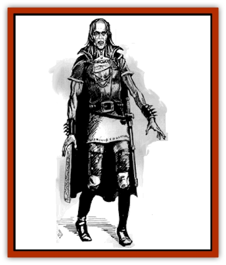
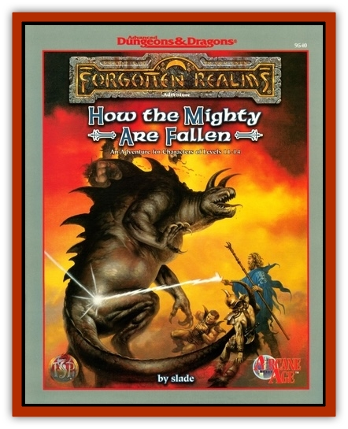

# Zombie - Netherese

| Statistic | **Zombie, Netherese** |
| --- | --- |
| **Activity Cycle:** | Any |
| **Alignment:** | Neutral evil |
| **Armor Class:** | 6 |
| **Climate/Terrain:** | Any |
| **Damage/Attack:** | 2d4/2d4 |
| **Diet:** | None |
| **Frequency:** | Rare |
| **Hit Dice:** | 6 |
| **Intelligence:** | Average (8-10) |
| **Magic Resistance:** | Nil |
| **Morale:** | Special |
| **Movement:** | 9 |
| **No. Appearing:** | 2d8 |
| **No. of Attacks:** | 2 |
| **Organization:** | None |
| **Size:** | M (6' tall) |
| **Special Attacks:** | Raise dead, control undead |
| **Special Defenses:** | Spell immunities |
| **THAC0:** | 15 |
| **Treasure:** | Nil |
| **XP Value:** | 650 |

Netherese zombies are undead creatures resembling normal [[Zombie|zombies]] that move about the surface of Netheril on various errands for their master, the [[Lich|Lich]]lord. While a few of these creatures are independent of their creator, most are known to serve the Lichlord in one manner or another.

These undead are frequently encountered wearing the same clothing as they did in life. It's not uncommon for Netherese zombies to be wearing fine robes and jewelry, death shrouds, or other clothing that they happened to be wearing before they were converted into undeath.

There's a sparkling of intelligence in a Netherese zombie - the last vestige of humanity left in its body. Each zombie speaks whatever languages it knew in life (typically common) and also communicates telepathically with the Lichlord.

**Combat:** Netherese zombies typically attack in force, seeking to overwhelm any opposition quickly. While a few servants of the Lichlord have been known to hurl daggers or flaming oil, most Neth zombies prefer the direct approach. Once a direct attack fails, however, the Lichlord is quick to inform other bands of his zombies to attack with ranged weapons, wait until night to attack, or simply ambush opponents. Netherese zombies are turned as spectres and attack during their normal Initiative (they don't always attack last in a round).

While engaged in melee, these zombies seek to pummel or claw their opponents to the ground. The Netherese zombie that defeats an opponent can then choose to *raise dead* on that creature, transforming him into a Netherese zombie in 1d4 turns. As the transformation comes to fruition, the skin slowly turns a pale white, fingernails become sharp, and the eyes sink in a bit.

A successfully cast *remove curse* versus 12th-level magic stops the transformation, returning the victim to the ranks of the dead. From there, a normal *raise dead* or *resurrection* spell can be used to bring the creature back to life as described above after being defeated in combat.

Zombies of Netherese variety can also control nonthinking undead ([[Skeleton|skeletons]], normal zombies, and others) within 30 feet. Such control is equivalent to that of an evil priest who successfully controls undead.

Netherese zombies are immune to *sleep*, *charm*, *hold*, death magic, poison, and cold-based attacks. A vial of holy water inflicts 2d4 points of damage.

**Habitat/Society:** Most Netherese zombies are loyal servants to the Lichlord. These creatures roam the lands of Netheril searching for new recruits to add to the Lichlord's army of undead. Each zombie possesses a burning desire to kill any human it encounters.

Netherese zombie retain most of their Intelligence (10 maximum) and the ability to speak. They also keep the personality and memories that they had in life, typically using these to their advantage in service to the Lichlord. Overall, creatures retain two-thirds of the abilities they had in life (so a fighter with 18 Strength would be reduced to a Strength of 12).

All of these undead answer only to the telepathic will of the Lichlord, though he may from time to time appoint a [[Wraith|wraith]] or [[Spectre|spectre]] to command in his stead.

**Ecology:** As zombies swell their ranks with those they defeat, it becomes increasingly difficult to oppose this wave of undead as it ravages the countryside. In short order, entire villages are absorbed into a growing mass of destruction that sweeps up anything it encounters. Fertile fields are trampled flat by their passing, and animals flee as they approach.

---
## Discovery & Documentation

**Source Publication:** How the Mighty Are Fallen (1996)
**Campaign Setting:** Forgotten Realms
**Author(s):** slade
