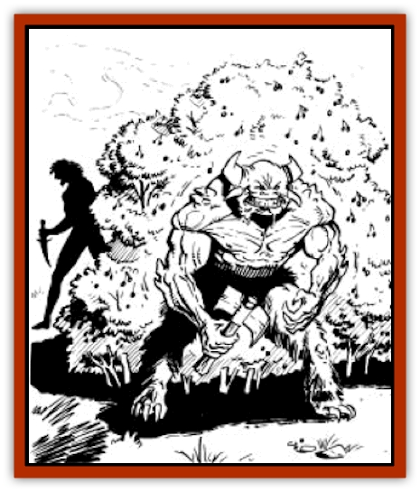

# Zombie Plant

| Statistic | **Zombie Plant** |
| --- | --- |
| **Activity Cycle:** | Day |
| **Alignment:** | Neutral |
| **Armor Class:** | 7 |
| **Climate/Terrain:** | Scrub plains, forest |
| **Damage/Attack:** | Nil |
| **Diet:** | Photosynthesis |
| **Frequency:** | Uncommon |
| **Hit Dice:** | 3 |
| **Intelligence:** | Semi- (2-4) |
| **Magic Resistance:** | Nil |
| **Morale:** | N/A |
| **Movement:** | 0 |
| **No. Appearing:** | 1 |
| **No. of Attacks:** | 0 |
| **Organization:** | Solitary |
| **Size:** | M (5-6' tall) |
| **Special Attacks:** | Berries |
| **Special Defenses:** | Berries |
| **THAC0:** | 17 |
| **Treasure:** | A |
| **XP Value:** | 120 |

**Psionics Summary**

| Level | Dis/Sci/Dev | Attack/Defense | Score | PSPs |
| --- | --- | --- | --- | --- |
| 3 | 1/0/1 | �/� | 8 | 20 |

**Telepathy -** *Sciences:* nil; *Devotion:* .

The zombie plant is a semi-intelligent shrub that produces highly nutritious berries. Anyone who partakes of the berries has a chance to become a slave of the zombie plant, existing only to serve and protect it. Its name comes not from its appearance, but from the mindless state of its servants.

A zombie plant resembles a healthy berry bush, with thick foliage. It bears fruit throughout the year; the berries are red (very much like full, ripe cherries) and grow in twos and threes like cherries do. The plant also has a clean, healthy scent, which is aided by its psionic power of attraction.

**Combat:** The zombie plant cannot physically attack or defend itself. It has only one method of attack; i.e., to attract a victim, and get him to eat some of its berries. The berries are delicious and do no harm to the victim. Each berry is also very nutritious and quite juicy. In fact, ten berries slake a man's thirst as well as a full half gallon of water would. Each berry eaten also heals one point of damage. But, one turn after eating the first berry, the victim must make a saving throw vs. poison, at a -1 penalty for each additional berry eaten. (Thus, ten berries eaten equals a -9 penalty to the saving throw.) Failure to save means that the victim has become addicted to the insidious berries. The victim now has only one desire, to protect the plant and its incredible fruit.

The zombie plant's main source of defense is its slaves. A slave exists on nothing but the berries, and they sustain him in fine physical condition. However, for each day that the slave lives on berries only, he loses one point of intelligence, permanently. Intelligence loss stops when it reaches one and stays there until the victim dies of neglect or, perhaps, in defense of the plant. Zombie slaves think only of the plant, gladly dumping all of their water out on the plant, feeding it, and in general seeing that it is safe and well.

If anyone threatens the zombie plant, its slaves fight to the death to defend it. Slaves use weapons, if they have them, but do not remember how to use spells, psionics, or any other special abilities they might have had. A side effect of the berries renders the slaves immune to *hold*, *charm*, or sleep magic, as well as to any telepathic psionic powers.

A zombie plant generally has one slave. It is possible for it to have as many as five, although that many tend to leave the plant stripped of berries. Without berries, the slaves weaken and eventually die. The strongest slave usually survives, for as soon as the plant produces new berries, the slaves will fight and destroy each other trying to get them.

The zombie plant only uses its attraction when a prospective slave comes near and usually if it does not have a slave at the time.

**Habitat/Society:** The zombie plant is a solitary plant with a well-defined territory. If two zombie plants grow within a mile of each other, the first to get a slave has his slave destroy the other plant. They can only sense other zombie plants within a mile.

The zombie plant typically grows from 101 to 200 berries (d100+100). Ten berries a day can keep a slave healthy and mindless. The plant can produce a new crop of berries every week. When not defending the plant, or fetching water or food, the slave generally just lies under the shade of the plant.

**Ecology:** The zombie plant needs as much water as a man. They tend to grow best near streams and lakes in the Forest Ridge, although occasionally plants do well in the scrub lands. These plants generally grow near trade routes or oases, where slaves and water are easily available.

---
## Discovery & Documentation

**Source Publication:** MC12 Dark Sun Appendix I - Terrors of the Desert (1991)
**Campaign Setting:** Dark Sun
**Author(s):** Tom Prusa, Louis J. Prosperi, Walter M. Baas

### Other Creatures Found in This Source Book
   * [[Animal_Herd_Athas|Animal, Herd (Athas)]]
   * [[Animal_Household_Athas|Animal, Household (Athas)]]
   * [[Antloid_Desert|Antloid, Desert]]
   * [[Banshee_Dwarf|Banshee, Dwarf]]
   * [[Beetle_Agony|Beetle, Agony]]
   * [[Bog_Wader|Bog Wader]]
   * [[Brambleweed|Brambleweed]]
   * [[B'rohg|B'rohg]]
   * [[Burnflower|Burnflower]]
   * [[Cat_Psionic|Cat, Psionic]]
   * [[Cha'thrang|Cha'thrang]]
   * [[Cistern_Fiend|Cistern Fiend]]
   * [[Clam_Giant|Clam, Giant]]
   * [[Cloud_Ray|Cloud Ray]]
   * [[Drake_Athas_Air|Drake (Athas), Air]]
   * [[Drake_Athas_Earth|Drake (Athas), Earth]]
   * [[Drake_Athas_Fire|Drake (Athas), Fire]]
   * [[Drake_Athas_Water|Drake (Athas), Water]]
   * [[Dune_Runner|Dune Runner]]
   * [[Dune_Trapper|Dune Trapper]]
   * [[Elemental_Athas_Greater_Air|Elemental (Athas), Greater, Air]]
   * [[Elemental_Athas_Greater_Earth|Elemental (Athas), Greater, Earth]]
   * [[Elemental_Athas_Greater_Fire|Elemental (Athas), Greater, Fire]]
   * [[Elemental_Athas_Greater_Water|Elemental (Athas), Greater, Water]]
   * [[Elemental_Athas_Lesser_Air_Earth|Elemental (Athas), Lesser, Air/Earth]]
   * [[Elemental_Athas_Lesser_Fire_Water|Elemental (Athas), Lesser, Fire/Water]]
   * [[Elemental_Athas_General_Information|Elemental (Athas), General Information]]
   * [[Erdland|Erdland]]
   * [[Esperweed|Esperweed]]
   * [[Flailer|Flailer]]
   * [[Floater|Floater]]
   * [[Giant_Athas|Giant (Athas)]]
   * [[Golem_Athas_I|Golem (Athas) I]]
   * [[Golem_Athas_II|Golem (Athas) II]]
   * [[Golem_Athas_III|Golem (Athas) III]]
   * [[Golem_Athas_General_Information|Golem (Athas), General Information]]
   * [[Halfling_Renegade|Halfling, Renegade]]
   * [[Hej-kin|Hej-kin]]
   * [[Id_Fiend|Id Fiend]]
   * [[Insect_Swarm_Athas|Insect Swarm (Athas)]]
   * [[Kank_Wild|Kank, Wild]]
   * [[Kirre|Kirre]]
   * [[Megapede|Megapede]]
   * [[Mul_Wild|Mul, Wild]]
   * [[Nightmare_Beast|Nightmare Beast]]
   * [[Plant_Carnivorous_Athas|Plant, Carnivorous (Athas)]]
   * [[Pterran|Pterran]]
   * [[Pterrax|Pterrax]]
   * [[Pulp_Bee|Pulp Bee]]
   * [[Pyreen|Pyreen]]
   * [[Rasclinn|Rasclinn]]
   * [[Razorwing|Razorwing]]
   * [[Roc_Athas|Roc (Athas)]]
   * [[Sand_Bride|Sand Bride]]
   * [[Sand_Cactus|Sand Cactus]]
   * [[Sand_Vortex|Sand Vortex]]
   * [[Scrab|Scrab]]
   * [[Silt_Horror|Silt Horror]]
   * [[Silt_Runner|Silt Runner]]
   * [[Sink_Worm|Sink Worm]]
   * [[Sloth_Athas|Sloth (Athas)]]
   * [[So-ut|So-ut]]
   * [[Spider_Cactus|Spider Cactus]]
   * [[Spider_Crystal|Spider, Crystal]]
   * [[Spirit_of_the_Land|Spirit of the Land]]
   * [[T'Chowb|T'Chowb]]
   * [[Thrax|Thrax]]
   * [[Tohr-kreen_I|Tohr-kreen I]]
   * [[Villichi|Villichi]]
   * [[Zhackal|Zhackal]]
