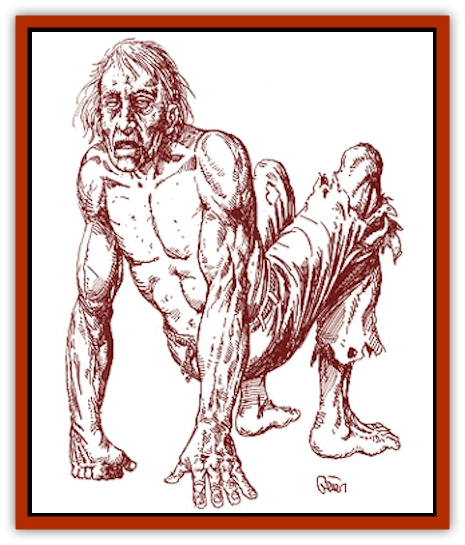

# Zombie - Red

| Statistic | **Zombie, Red** |
| --- | --- |
| **Activity Cycle:** | Night |
| **Alignment:** | Neutral (evil) |
| **Armor Class:** | 8 |
| **Climate/Terrain:** | Any |
| **Damage/Attack:** | 1d8 |
| **Diet:** | <i>Cinnabryl</i> |
| **Frequency:** | Rare |
| **Hit Dice:** | 2 |
| **Intelligence:** | Low (5-7) |
| **Magic Resistance:** | Nil |
| **Morale:** | Special |
| **Movement:** | 9 |
| **No. Appearing:** | 1d6 |
| **No. of Attacks:** | 1 |
| **Organization:** | Solitary |
| **Size:** | M (4-7' tall) |
| **Special Attacks:** | Deplete <i>cinnabryl</i> |
| **Special Defenses:** | Spell immunities |
| **THAC0:** | 19 |
| **Treasure:** | Nil |
| **XP Value:** | 270 / 420 w/1 Legacy / 650 w/2 Legacies |

Red [[Zombie|zombies]] are usually formed when a wicked mage or priest uses the spell *animate dead* to enchant the corpse of an Afflicted person. A red zombie will sometimes spontaneously form when somebody dies from the "red blight", a form of illness that causes non-Legacy using creatures, or those beyond the limits of the Haze, who wear *cinnabryl* to lose 1 point of Constitution per day until dead. A person who dies from the red blight and is not blessed during the burial has a 10% of rising one day later as a red zombie.

Red zombies ceaselessly pursue *cinnabryl*-using creatures. Because the malady that killed them was caused by wearing *cinnabryl*, they are obsessed with destroying as much of the magical metal as they can. Regardless of the creature's alignment in life, the desire for destruction warps the red zombie into an evil creature. Their dim intelligence and ability to follow complex orders makes them slightly more useful than normal zombies to the evil mages and priests who animate these creatures. Still, their obsession with *cinnabryl* makes red zombies difficult to control. While under the control of a priest or mage, a red zombie is allowed a saving throw vs. spell once every four weeks. If the saving throw succeeds, it escapes control and turns on its master.

A red zombie looks much as it did at the moment of its death, except for its dull red skin. It also emanates a bright red glow from the eyes and mouth. Red zombies have terrible mutations as a result of their Afflictions. Even if they do not have Legacies, the curse still warps them horribly.

*The Red Curse:* A red zombie that was a non-Legacy-using creature in life never acquires any Legacies. However, a red zombie that did have Legacies in life retains them in undeath. A red zombie that was an Inheritor in life will have at least two Legacies, and may have more (DM's option).

**Combat:** Red zombies behave much like standard zombies in combat. They are slow and unsteady, so they strike last in the combat round. They claw and gouge the flesh from their victims, eating it as they go. Red zombies prefer to attack creatures carrying *cinnabryl*. Red zombies are immune to *sleep*, *charm*, *hold*, death magic, poisons, and cold-based spells. A vial of holy water inflicts 2d4 points of damage (as acid) if it successfully strikes a red zombie.

Red zombies also deplete *cinnabryl*. They do this by eating the raw flesh of their victims. For each point of damage the red zombie inflicts, it depletes one day's worth of *cinnabryl* from its victim. A victim struck for 7 points of damage would immediately lose 7 day's worth (1 ounce) of *cinnabryl*. In addition, the red zombie gains 1 hit point for each full ounce of *cinnabryl* that it depletes from its victims. These extra hit points are temporary and vanish when the sun rises the next morning.

A red zombie will keep attacking relentlessly, stopping only when all of its potential victims are dead.

Red zombies also suffer double damage from weapons forged of *red steel*.

**Habitat/Society:** Red zombies congregate near sources of *cinnabryl* and pursue creatures who use *cinnabryl*. They have the ability to automatically detect this magical metal.

Each red zombie is an individual creature; they rarely act as a group unless controlled by some outside force. They can be controlled by evil mages and priests.

**Ecology:** Red zombies are not natural creatures, so they play little or no role in the ecological system. They do, however, present a danger to *cinnabryl*-using creatures.

---
## Discovery & Documentation

**Source Publication:** Monstrous Compendium Savage Coast Appendix (Online Exclusive) (1995)
**Campaign Setting:** Mystara
**Author(s):** Loren L Coleman, Ted James, Thomas Zuvich, Cindi M. Rice

### Other Creatures Found in This Source Book
   * [[Aranea_Savage_Coast|Aranea (Savage Coast)]]
   * [[Arashaeem|Arashaeem]]
   * [[Batracine|Batracine]]
   * [[Cat_Marine|Cat, Marine]]
   * [[Cinnavixen|Cinnavixen]]
   * [[Clockwork_Swordsman|Clockwork Swordsman]]
   * [[Critter_Temple|Critter, Temple]]
   * [[Cursed_One|Cursed One]]
   * [[Deathmare|Deathmare]]
   * [[Dragon_Savage_Coast_Crimson|Dragon (Savage Coast), Crimson]]
   * [[Dragon_Savage_Coast_Red_Hawk|Dragon (Savage Coast), Red Hawk]]
   * [[Echyan|Echyan]]
   * [[Ee'aar|Ee'aar]]
   * [[Enduk|Enduk]]
   * [[Fachan_Savage_Coast|Fachan (Savage Coast)]]
   * [[Feliquine|Feliquine]]
   * [[Fiend_Narvaezan|Fiend, Narvaezan]]
   * [[Frelôn|Frelôn]]
   * [[Ghriest|Ghriest]]
   * [[Glutton_Sea|Glutton, Sea]]
   * [[Goatman|Goatman]]
   * [[Golem_Naâruk|Golem, Naâruk]]
   * [[Golem_Savage_Coast|Golem (Savage Coast)]]
   * [[Grudgling|Grudgling]]
   * [[Heraldic_Servant_I|Heraldic Servant I]]
   * [[Heraldic_Servant_II|Heraldic Servant II]]
   * [[Heraldic_Servant_III|Heraldic Servant III]]
   * [[Heraldic_Servant_IV|Heraldic Servant IV]]
   * [[Heraldic_Servant_V|Heraldic Servant V]]
   * [[Heraldic_Servant_General_Information|Heraldic Servant, General Information]]
   * [[Hermit_Sea|Hermit, Sea]]
   * [[Jorri|Jorri]]
   * [[Juhrion|Juhrion]]
   * [[Kla'a-tah|Kla'a-tah]]
   * [[Leech_Legacy|Leech, Legacy]]
   * [[Lich_Inheritor|Lich, Inheritor]]
   * [[Lizard_Kin_Savage_Coast|Lizard Kin (Savage Coast)]]
   * [[Lupasus|Lupasus]]
   * [[Lupin|Lupin]]
   * [[Lyra_Bird_Saragón|Lyra Bird, Saragón]]
   * [[Malfera|Malfera]]
   * [[Manscorpion_Nimmurian|Manscorpion, Nimmurian]]
   * [[Mythuínn_Folk|Mythuínn Folk]]
   * [[Neshezu|Neshezu]]
   * [[Nikt'oo|Nikt'oo]]
   * [[Nosferatu|Nosferatu]]
   * [[Omm-wa|Omm-wa]]
   * [[Omshirim|Omshirim]]
   * [[Parasite_Savage_Coast|Parasite (Savage Coast)]]
   * [[Phanaton|Phanaton]]
   * [[Plant_Savage_Coast|Plant (Savage Coast)]]
   * [[Pudding_Vermilion|Pudding, Vermilion]]
   * [[Rakasta|Rakasta]]
   * [[Ray_Forest|Ray, Forest]]
   * [[Shedu_Greater_Savage_Coast|Shedu, Greater (Savage Coast)]]
   * [[Shimmerfish|Shimmerfish]]
   * [[Skinwing|Skinwing]]
   * [[Spawn_of_Nimmur|Spawn of Nimmur]]
   * [[Spider-spy|Spider-spy]]
   * [[Spirit_Heroic|Spirit, Heroic]]
   * [[Spirit_Walleran|Spirit, Walleran]]
   * [[Succulus|Succulus]]
   * [[Swampmare|Swampmare]]
   * [[Symbiont_Shadow|Symbiont, Shadow]]
   * [[Tortle|Tortle]]
   * [[Troll_Legacy|Troll, Legacy]]
   * [[Trosip|Trosip]]
   * [[Tyminid|Tyminid]]
   * [[Utukku|Utukku]]
   * [[Voat|Voat]]
   * [[Voat_Herathian|Voat, Herathian]]
   * [[Vulturehound|Vulturehound]]
   * [[Wallara|Wallara]]
   * [[Wurmling|Wurmling]]
   * [[Wynzet|Wynzet]]
   * [[Yeshom|Yeshom]]
