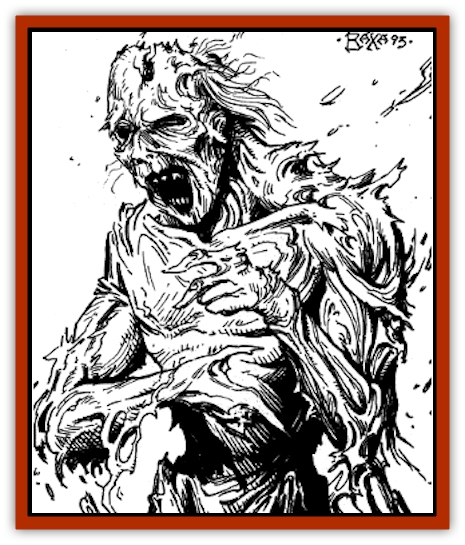
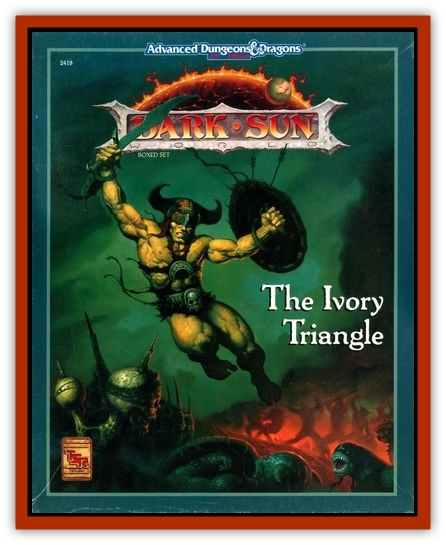

# Zombie - Salt

| Statistic | **Zombie, Salt** |
| --- | --- |
| **Activity Cycle:** | Night |
| **Alignment:** | Chaotic evil |
| **Armor Class:** | See below |
| **Climate/Terrain:** | The Great Ivory Plain |
| **Damage/Attack:** | 3-18 |
| **Diet:** | Water |
| **Frequency:** | Very rare |
| **Hit Dice:** | 4+2 |
| **Intelligence:** | Low (5-7) |
| **Magic Resistance:** | See below |
| **Morale:** | Fearless (19-20) |
| **Movement:** | 12 |
| **No. Appearing:** | 1-4 |
| **No. of Attacks:** | 1 |
| **Organization:** | Solitary |
| **Size:** | M (6') |
| **Special Attacks:** | Blood drain |
| **Special Defenses:** | See below |
| **THAC0:** | 17 |
| **Treasure:** | As in life |
| **XP Value:** | 420 |

The salt [[Zombie|zombie]] is an [[Undead_Athas_General_Information|undead]] creature born of hate (and possibly a subtle magic of the Great Ivory Plain). Resembling the common zombie, these animated corpses are much more powerful (and even a little more intelligent) than their purely magical brethren. These creatures are formed when a human or demihuman dies of thirst in the Great Ivory Plain.

Unlike common zombies, salt zombies do not look like rotting corpses, but rather resemble a thin and desiccated husk, appearing almost mummified (although not wrapped in strips of linen like a [[Mummy|mummy]]). The eyes of a salt zombie are sunken and shriveled, the limbs are thin and spindly, and the abdomen is desiccated and thin. Their lips are often dry and cracked, but do not bleed.

**Combat:** Salt zombies pursue the living for the water within them. Their thirst for this water is overwhelming, and salt zombies can sense victims for a distance of up to 5 miles.

When attacking, the salt zombie strikes until it inflicts a wound that draws blood (i.e., until it inflicts damage upon the victim). At that point it lunges for the victim, sucking at the bleeding wound. The zombie must make a roll to hit to get its mouth on the wound, but it then hits automatically for 1-6 points of damage each round. The first strike often incapacitates its foe, but in any case the salt zombie continues to drink until all blood is rained and the victim is dead.

Once the salt zombie has grabbed a victim, they may attack the zombie with weapons of size S only. Other weapons are too long and unwieldily to attack an opponent so near. Other individuals may attack the salt zombie normally, but on a roll of 1 (or on a roll that is at least 10 less than is required to hit the salt zombie), they hit their companion instead.

The salt zombie can be hit by normal weapons, but its Armor Class is the same as it had in life, with an additional -2 bonus because of its desiccated condition. Thus, a salt zombie wearing no armor is treated as Armor Class 8, while a salt zombie wearing scale mail would be treated as Armor Class 4. Salt zombies never wear shields or use weapons.

Like other undead, zombies are immune to *sleep*, *charm*, *hold*, death magic, poisons, and cold-based spells. A vial of holy water inflicts 2-8 points of damage, and a *create water* spell immediately sates the zombie, sending it into a torpid state for 1-6 days. Nonmagical weapons inflict half damage on salt zombies due to their desiccated condition, but they suffer double damage from fire-based attacks.

**Habitat/Society:** Salt zombies have little in the way of actual society. They are not intelligent in the normal sense, but are driven to attack by the thirst that possesses them. They band together in packs for survival, but once combat is enjoined it is every zombie for itself.

**Ecology:** There appear to be several areas of the Great Ivory Plain where a person who has died of thirst will become a salt zombie. (A person who dies of thirst through hit point loss does not become a salt zombie.) The sheer force of will of an individual refusing to die seems to somehow reanimate their corpse in these peculiar regions. It is unknown what sort of residual magic may linger in these areas to cause such an effect. There is a 5% chance that any person dying of thirst in the Great Ivory Plain will reanimate.

---
## Discovery & Documentation

**Source Publication:** The Ivory Triangle (1993)
**Campaign Setting:** Dark Sun
**Author(s):** Curtis Scott, Kirk Botula

### Other Creatures Found in This Source Book
   * [[Bloodvine|Bloodvine]]
   * [[Cilops|Cilops]]
   * [[Treant_Athas|Treant (Athas)]]
