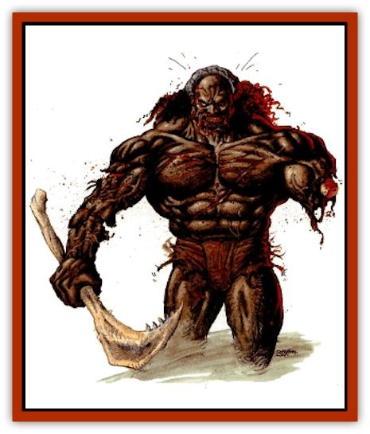

# Zombie - Thinking

| Statistic | **Zombie, Thinking** |
| --- | --- |
| **Activity Cycle:** | Any, see below |
| **Alignment:** | Neutral evil |
| **Armor Class:** | As in life, or 6 |
| **Climate/Terrain:** | Any |
| **Damage/Attack:** | By weapon type or 5-10/5-10 |
| **Diet:** | Carnivorous (human flesh) |
| **Frequency:** | Very rare |
| **Hit Dice:** | As in life, minimum 5+6 |
| **Intelligence:** | Average (8-10) |
| **Magic Resistance:** | Nil |
| **Morale:** | Fearless (19-20) |
| **Movement:** | 12 |
| **No. Appearing:** | 1 |
| **No. of Attacks:** | 1 or 2 |
| **Organization:** | Solitary |
| **Size:** | S-L (4-15') |
| **Special Attacks:** | See below |
| **Special Defenses:** | See below |
| **THAC0:** | As in life, minimum 15 |
| **Treasure:** | See below |
| **XP Value:** | 420 + 65 per HD over 5 |

**Psionics Summary**

| Level | Dis/Sci/Dev | Attack/Defense | Score | PSPs |
| --- | --- | --- | --- | --- |
| Varies | Varies | Varies | Varies | Varies |

A thinking [[Zombie|zombie]] is a creature who has died and its spirit cannot rest until it has completed the task. The body remains animate and the zombie is semi-free willed, bound only by its dedication to completing its assigned duties.

Thinking zombies are easy to identify because their bodies are usually in very good condition since they reanimated shortly after death. Their eyes burn with a spark of hate for all living things and a consuming desire to complete their task and achieve final rest. Most thinking zombies are [[Giant_Athas|giants]] or [[Giant_Half-giant|half-giants]] as those creatures are often subject to the *geas* and *quest* spells that create them. They usually wear the same clothes they had in life and carry the same weapons. Any wounds they had on their body in death would betray their [[Undead_Athas_General_Information|undead]] nature, as the flesh of thinking zombies does not heal even if they regain lost hit points. Those who travel freely in the day often begin to stink like rotting corpses, so most prefer to move about at night.

**Combat:** Thinking zombies are clever undead. They retain the same intelligence they had in life, though it is focused on the purpose for which they still exist. They avoid the living whenever possible, but attack anyone who tries to prevent them from completing their task.

Thinking zombies have 18/76 Strength, unless their Strength in life was greater, in which case it remains the same. Those with 18/76 Strength gain a +2 bonus to their attack roll and cause +4 attack damage. Thinking zombies retain the same Dexterity they had in life. They can use normal weapons, including missile weapons, and commonly attack with the weapons they carried in life. They can also attack with their fists, causing 5-10 points of damage.

The bite of a thinking zombie has the same effect as the 3rd level priest spell *cause disease*, infecting the victim with a fatal disease.

Thinking zombies are immune to all *sleep*, *hold*, *charm*, *illusions*, mind-affecting spells, death magic, and all cold-based spells, and all forms of poison and paralysis. They suffer only half damage from *magic missiles* and all fire and electrical attacks. Holy water causes them 2-8 (2d4) points of damage. *Raise dead* requires them to make a successful save vs. spell or be destroyed.

**Habitat/Society:** Thinking zombies are far more active at night than during the day. Darkness allows them to more easily pass as living beings and the heat of the day causes them to stink like rotting corpses. Animals will bark and growl whenever thinking zombies are nearby.

**Ecology:** Thinking zombies hold no natural place among the living and seek an end to their own existence. They cannot actively seek any other end to their existence except through completion of their assigned task. They do not rest until it is done. They might return as [[Racked_Spirit|racked spirits]] because they were unable to complete their tasks as thinking zombies.

---
## Discovery & Documentation

**Source Publication:** Dark Sun Appendix II - Terrors Beyond Tyr (1991)
**Campaign Setting:** Dark Sun
**Author(s):** Jim Atkiss, Steve Brown, Timothy B. Brown, Andrew P. Morris, Bruce Nesmith, Wes Nicholson, Bill Slavicsek

### Other Creatures Found in This Source Book
   * [[Aarakocra_Athas|Aarakocra (Athas)]]
   * [[Animal_Domestic_Athas_II|Animal, Domestic (Athas) II]]
   * [[Aviarag|Aviarag]]
   * [[Baazrag|Baazrag]]
   * [[Baazrag_Boneclaw|Baazrag, Boneclaw]]
   * [[Bloodgrass|Bloodgrass]]
   * [[Cactus_Hunting|Cactus, Hunting]]
   * [[Cactus_Rock|Cactus, Rock]]
   * [[Cilops|Cilops]]
   * [[Crodlu|Crodlu]]
   * [[Dagorran|Dagorran]]
   * [[Dhaot|Dhaot]]
   * [[Drake_Lesser_Athas_General_Information|Drake, Lesser (Athas), General Information]]
   * [[Drake_Lesser_Athas_Magma|Drake, Lesser (Athas), Magma]]
   * [[Drake_Lesser_Athas_Rain|Drake, Lesser (Athas), Rain]]
   * [[Drake_Lesser_Athas_Silt|Drake, Lesser (Athas), Silt]]
   * [[Drake_Lesser_Athas_Sun|Drake, Lesser (Athas), Sun]]
   * [[Dray|Dray]]
   * [[Drik|Drik]]
   * [[Dune_Reaper|Dune Reaper]]
   * [[Dwarf_Athas|Dwarf (Athas)]]
   * [[Elemental_Beast_Athas_Air|Elemental Beast (Athas), Air]]
   * [[Elemental_Beast_Athas_Earth|Elemental Beast (Athas), Earth]]
   * [[Elemental_Beast_Athas_Fire|Elemental Beast (Athas), Fire]]
   * [[Elemental_Beast_Athas_Water|Elemental Beast (Athas), Water]]
   * [[Elf_Athas|Elf (Athas)]]
   * [[Fael|Fael]]
   * [[Feylaar|Feylaar]]
   * [[Fordorran|Fordorran]]
   * [[Giant_Half-giant|Giant, Half-giant]]
   * [[Giant_Shadow|Giant, Shadow]]
   * [[Golem_Athas_Magma|Golem (Athas), Magma]]
   * [[Golem_Athas_Salt|Golem (Athas), Salt]]
   * [[Golem_Athas_General_Information|Golem (Athas), General Information]]
   * [[Gorak|Gorak]]
   * [[Halfling_Athas|Halfling (Athas)]]
   * [[Human_Athas|Human (Athas)]]
   * [[Jhakar|Jhakar]]
   * [[Kaisharga|Kaisharga]]
   * [[Kes'trekel|Kes'trekel]]
   * [[Klar|Klar]]
   * [[Krag|Krag]]
   * [[Kragling|Kragling]]
   * [[Lirr|Lirr]]
   * [[Mastyrial|Mastyrial]]
   * [[Meorty|Meorty]]
   * [[Mul|Mul]]
   * [[Nikaal|Nikaal]]
   * [[Paraelemental_Beast_General_Information|Paraelemental Beast, General Information]]
   * [[Paraelemental_Beast_Magma|Paraelemental Beast, Magma]]
   * [[Paraelemental_Beast_Rain|Paraelemental Beast, Rain]]
   * [[Paraelemental_Beast_Silt|Paraelemental Beast, Silt]]
   * [[Paraelemental_Beast_Sun|Paraelemental Beast, Sun]]
   * [[Pakubrazi|Pakubrazi]]
   * [[Psionocus|Psionocus]]
   * [[Psurlon|Psurlon]]
   * [[Raaig|Raaig]]
   * [[Retriever_Obsidian|Retriever, Obsidian]]
   * [[Ruktoi|Ruktoi]]
   * [[Ruvoka_Athas|Ruvoka (Athas)]]
   * [[Sand_Howler|Sand Howler]]
   * [[Scorpion_Athas|Scorpion (Athas)]]
   * [[Seed_Brain|Seed, Brain]]
   * [[Silt_Horror_Black|Silt Horror, Black]]
   * [[Silt_Horror_Magma|Silt Horror, Magma]]
   * [[Silt_Horror_Red|Silt Horror, Red]]
   * [[Silt_Spawn|Silt Spawn]]
   * [[Slig|Slig]]
   * [[Spider_Athas|Spider (Athas)]]
   * [[Spinewyrm|Spinewyrm]]
   * [[Ssurran|Ssurran]]
   * [[Stalking_Horror|Stalking Horror]]
   * [[Tarek|Tarek]]
   * [[Tari|Tari]]
   * [[Thri-kreen|Thri-kreen]]
   * [[T'liz|T'liz]]
   * [[Tohr-kreen_II|Tohr-kreen II]]
   * [[Tohr-kreen_III|Tohr-kreen III]]
   * [[Trin|Trin]]
   * [[Tul'k|Tul'k]]
   * [[Undead_Athas_General_Information|Undead (Athas), General Information]]
   * [[Wraith_Athas|Wraith (Athas)]]
   * [[Xerichou|Xerichou]]
