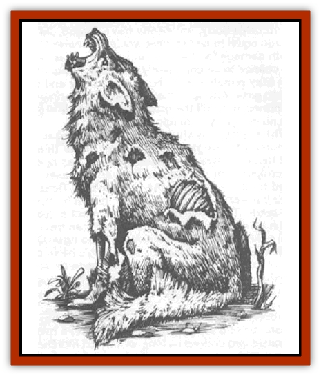

# Zombie Wolf

| Statistic | **Zombie Wolf** |
| --- | --- |
| **Activity Cycle:** | Any (usually night) |
| **Alignment:** | Neutral evil |
| **Armor Class:** | 6 |
| **Climate/Terrain:** | Any (Forlorn) |
| **Damage/Attack:** | 1d4+1 |
| **Diet:** | None |
| **Frequency:** | Very rare |
| **Hit Dice:** | 2+2 |
| **Intelligence:** | Non- (0) |
| **Magic Resistance:** | Nil |
| **Morale:** | Fearless (19-20) |
| **Movement:** | 9 |
| **No. Appearing:** | 2d4 |
| **No. of Attacks:** | 1 |
| **Organization:** | None |
| **Size:** | S (2-4') |
| **Special Attacks:** | Nil |
| **Special Defenses:** | See below |
| **THAC0:** | 19 |
| **Treasure:** | Nil |
| **XP Value:** | 120 |

[[Zombie|Zombie]] [[Wolf|wolves]] are not created by a wizard or a priest, but are a creation of the domain of Forlorn itself. Because a zombie wolf looks exactly as it did in death, these creatures often have gaping wounds and sometimes are even missing a limb. They have dirty, matted fur and a rotten stench that is noticeable up to 100 feet away.

A zombie wolf cannot howl like its living counterparts, but it does occasionally throw back its head and utter a strangled cry from rotting vocal chords (prompting a horror check the first time it is heard). These creatures move with a stiff-legged gait at half the speed of a living wolf.

**Combat:** Like all zombies, the slower speed of the zombie wolf means that it strikes last in any combat round (it automatically loses the initiative). While they can be turned and destroyed by priests, zombie wolves otherwise fight mindlessly until their intended target is dead or they are destroyed. They will break off their attack only if called off by the lord of the domain.

Zombie wolves have an Armor Class that is slightly better than that of regular wolves, due to the toughness of their dead, leathery skin. They attack by biting, just as living wolves do, inflicting 1d4+1 points of damage upon a successful hit.

Like other undead, zombie wolves are immune to *charm*, *hold*, and *sleep* spells, as well as death magic, poison, and cold-based spells. Holy water can also damage them, inflicting 2d4 points of damage when it strikes them. They are turned as zombies, except when they are acting under the direct control or orders of the lord of Forlorn, at which time they impose a -2 penalty upon a priest's attempt to turn them.

**Habitat/Society:** Zombie wolves are usually found within a few miles of the spot where they were killed (and rose again to unlife). Like living wolves, they tend to form packs, but these are much smaller than normal, with no more than eight members. Under special circumstances, such as an assemblage called together by the lord, the pack can contain virtually every zombie wolf in the domain. It takes 1d6 hours for a pack of this size to accumulate, and anyone who sees the mass of monsters gathering is easily subject to both fear and horror checks, even if the pack hasn't yet mobilized or chosen the viewer as its prey.

**Ecology:** Zombie wolves rise from the dead when the body of any regular wolf in the domain of Forlorn is not decapitated after it is killed. If this gruesome task is not carried out, the corpse of the wolf rises as a zombie 2d8 days after it has died.

It is generally thought that the creatures gain this strange form of existence from contact with the land itself, which channels energy from the Negative Material Plane. Some sages speculate that simply preventing the wolf carcass from having any contact with the ground for a full eight days will prevent it from rising as a zombie, but in the absence of any practical application of this theory, it remains unproven.

---
## Discovery & Documentation

**Source Publication:** Castles Forlorn (1993)
**Campaign Setting:** Ravenloft
**Author(s):** Lisa Smedman

### Other Creatures Found in This Source Book
   * [[Aggie|Aggie]]
   * [[Death's_Head_Tree|Death's Head Tree]]
