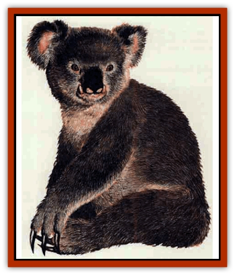

# Zorbo

| Statistic | **Zorbo** |
| --- | --- |
| **Activity Cycle:** | Any |
| **Alignment:** | Neutral |
| **Armor Class:** | 7 base (see below) |
| **Climate/Terrain:** | Any non-arctic land |
| **Damage/Attack:** | 1d4/1d4/1d2 |
| **Diet:** | Carnivore |
| **Frequency:** | Rare |
| **Hit Dice:** | 4+2 |
| **Intelligence:** | Semi- (2-4) |
| **Magic Resistance:** | 20% |
| **Morale:** | Steady (11) |
| **Movement:** | 15, Cl 9 |
| **No. Appearing:** | 1-4 (10-60) |
| **No. of Attacks:** | 3 |
| **Organization:** | Solitary |
| **Size:** | S (3' tall) |
| **Special Attacks:** | Absorption |
| **Special Defenses:** | Drain magical protection |
| **THAC0:** | 17 |
| **Treasure:** | Nil (P. Q, X) |
| **XP Value:** | 420 |

More than one traveler has been lured to his death by mistaking this creature at a distance as a cuddly, black-and-white koala bear. Such a mistake becomes painfully obvious when the mature attacks. They are semi-intelligent; only those able to communicate with [[Bear|bears]] can communicate with them.

**Combat:** The zorbo frequently takes advantage of its absorption ability before attacking, for example, moving near large rocks to absorb a good Armor Class value. This absorption process requires one round, during which time the zorbo presses itself against an object. This activity is similar to that of a bear scratching its back on a tree. In fact, this action is a sign of aggression and not an indication of playfulness.

Absorption does not harm the object whose Armor Class is being absorbed. The absorbed Armor Class lasts for 1-4 hours. The ability grants the zorbo an AC rating based on the chart.

| AC Rating | Item | Order of Absorption |
| --- | --- | --- |
| 7 | Earth | Shield |
| 6 | Rock Crystal, Ice | Armor |
| 5 | Wood | Bracers |
| 4 | Soft Metal (jewelry, gold) | Cloaks |
| 3 | Hard Metal (swords, shields) | Rings |
| 0 | Stone | Passive Items* |

<small>* These include magical items like a *staff of power* or *long sword, +4 defender* that grant an Armor Class bonus in addition to their other abilities. These items are always the last to be absorbed by the zorbo.</small>

The zorbo's most feared form of attack drains the defensive magic of creatures it strikes. Each time the zorbo hits a target protected by magical armor, a *ring of protection*, *bracers of defense*, or similar defense, the magical pluses of the item are added to the zorbo's AC for one full turn and the item is turned to dust (no saving throw). If the item does not grant a magical plus (e.g., *bracers of defense*), the AC adjustment to a base AC1O is absorbed instead. For example, a zorbo whose current Armor Class is 0 strikes a character wearing *bracers of defense AC6*. The result is that the bracers are destroyed and the zorbo's new AC is -4. Artifacts are not destroyed.

If a creature is wearing multiple defensive items, determine randomly which item the zorbo strikes or use the chart. The pluses absorbed also count toward any saving throws the zorbo is required to make for that turn.

**Habitat/Society:** This carnivorous beast often develops a taste for human and demihuman flesh, and it frequently lives where it can prey upon its favorite morsels. Such lairs typically include small caves, hollowed-out trees, or even large holes that it digs with its sharp claws. While zorbos prefer the taste of meat, they occasionally eat berries and fish.

Zorbos normally mate for life and produce one or two cubs every other spring. If multiple zorbos are encountered, they are most likely from a family unit. After two years, the cubs are chased away from the lair of their parents. The cubs either find a lair of their own or perish in the wild.

It has been reported that in some of the deeper forests and less traveled lands, zorbos gather in small communities numbering from 10 to 60. Thee communities have probably developed as a means of self-preservation in the more dangerous lands.

Such communities are always guarded by zorbo sentries. These vigilant zorbos are always looking for signs of predators, but have also been known to signal for an attack on unsuspecting passers-by. Walking too close to a zorbo community often incites an attack by the entire population.

**Ecology:** Bears seem to be a natural enemy of the zorbo, attacking them on sight. Whether this has something to do with the zorbo's appearance or the fact that their roar sounds like a bear cub crying is subject to speculation.

Zorbo hide that has been properly treated is an ideal receptacle for enchantments. Items made of this material, soaked in holy water and enchanted under a full moon, receive an additional +1 on item saving throws.

---
## Discovery & Documentation

**Source Publication:** Monstrous Compendium, 1995 Annual, Volume 2 (1995)
**Campaign Setting:** Advanced Dungeons & Dragons 2nd Edition
**Author(s):** Jon Pickens

### Other Creatures Found in This Source Book
   * [[Aboleth_Savant|Aboleth, Savant]]
   * [[Addazahr|Addazahr]]
   * [[Amiq_Rasol|Amiq Rasol]]
   * [[Arch-Shadow|Arch-Shadow]]
   * [[Automaton_Scaladar|Automaton, Scaladar]]
   * [[Automaton_Trobriand's|Automaton, Trobriand's]]
   * [[Bat_Sporebat|Bat, Sporebat]]
   * [[Beetle_Dragon|Beetle, Dragon]]
   * [[Bi-nou|Bi-nou]]
   * [[Boggle|Boggle]]
   * [[Brownie_Dobie|Brownie, Dobie]]
   * [[Brownie_Quickling|Brownie, Quickling]]
   * [[Cat_Crypt|Cat, Crypt]]
   * [[Cat_Great_Cath_Shee|Cat, Great, Cath Shee]]
   * [[Centaur-kin_Dorvesh|Centaur-kin, Dorvesh]]
   * [[Centaur-kin_Gnoat|Centaur-kin, Gnoat]]
   * [[Centaur-kin_Ha'pony|Centaur-kin, Ha'pony]]
   * [[Centaur-kin_Zebranaur|Centaur-kin, Zebranaur]]
   * [[Chronolily|Chronolily]]
   * [[Curst|Curst]]
   * [[Darktentacles|Darktentacles]]
   * [[Dinosaur_Aquatic|Dinosaur, Aquatic]]
   * [[Dinosaur_II|Dinosaur II]]
   * [[Dinosaur_III|Dinosaur III]]
   * [[Doppelganger_Greater|Doppelganger, Greater]]
   * [[Dragon_Brine|Dragon, Brine]]
   * [[Dragon_Half-|Dragon, Half-]]
   * [[Dragon-kin_Sea_Wyrm|Dragon-kin, Sea Wyrm]]
   * [[Dwarf_Wild|Dwarf, Wild]]
   * [[Ekimmu|Ekimmu]]
   * [[Elemental_Nature|Elemental, Nature]]
   * [[Elf_Winged|Elf, Winged]]
   * [[Fish_Great_Glacier|Fish (Great Glacier)]]
   * [[Fish_Subterranean|Fish, Subterranean]]
   * [[Fish_Toril|Fish (Toril)]]
   * [[Flareater|Flareater]]
   * [[Flumph|Flumph]]
   * [[Froghemoth|Froghemoth]]
   * [[Ghost_Casurua|Ghost, Casurua]]
   * [[Ghost_Ker|Ghost, Ker]]
   * [[Ghul|Ghul]]
   * [[Ghul-Kin|Ghul-Kin]]
   * [[Giant_Half-giant|Giant, Half-giant]]
   * [[Golem_Burning_Man|Golem, Burning Man]]
   * [[Golem_Phantom_Flyer|Golem, Phantom Flyer]]
   * [[Gulguthhydra|Gulguthhydra]]
   * [[Hakeashar|Hakeashar]]
   * [[Horse_Moon-|Horse, Moon-]]
   * [[Human_Dragonslayer|Human, Dragonslayer]]
   * [[Human_Vistana|Human, Vistana]]
   * [[Jellyfish_Giant|Jellyfish, Giant]]
   * [[Kalin|Kalin]]
   * [[Kholiathra|Kholiathra]]
   * [[Laerti|Laerti]]
   * [[Leucrotta_Greater|Leucrotta, Greater]]
   * [[Lich_Suel|Lich, Suel]]
   * [[Lurker_Shadow|Lurker, Shadow]]
   * [[Lycanthrope_Werepanther|Lycanthrope, Werepanther]]
   * [[Lycanthrope_Wereshark|Lycanthrope, Wereshark]]
   * [[Mammal_Herd_II|Mammal, Herd II]]
   * [[Marl|Marl]]
   * [[Meenlock|Meenlock]]
   * [[Mimic_Greater|Mimic, Greater]]
   * [[Mold_II|Mold II]]
   * [[Mummy_Creature|Mummy, Creature]]
   * [[Nyth|Nyth]]
   * [[Ooze_Slime_Jelly_Ghaunadan|Ooze/Slime/Jelly, Ghaunadan]]
   * [[Palimpsest|Palimpsest]]
   * [[Peltast|Peltast]]
   * [[Plant_Dangerous_II|Plant, Dangerous II]]
   * [[Pleistocene_Animal|Pleistocene Animal]]
   * [[Pudding_Subterranean|Pudding, Subterranean]]
   * [[Raggamoffyn|Raggamoffyn]]
   * [[Snake_Serpent|Snake, Serpent]]
   * [[Snake_Serpent_Vine|Snake, Serpent Vine]]
   * [[Sphinx_Draco-|Sphinx, Draco-]]
   * [[Sprite_Seelie_Faerie|Sprite, Seelie Faerie]]
   * [[Sprite_Unseelie_Faerie|Sprite, Unseelie Faerie]]
   * [[Squealer|Squealer]]
   * [[Turtle_Giant|Turtle, Giant]]
   * [[Umpleby|Umpleby]]
   * [[Vizier's_Turban|Vizier's Turban]]
   * [[Wall_Walker|Wall Walker]]
   * [[Webbird|Webbird]]
   * [[Yak-Man|Yak-Man]]
