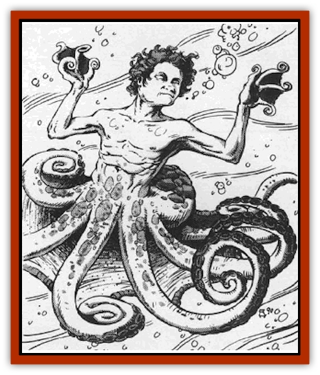

# Zoveri

| Statistic | **Zoveri** |
| --- | --- |
| **Activity Cycle:** | Any |
| **Alignment:** | Lawful good |
| **Armor Class:** | 5 |
| **Climate/Terrain:** | Seven Heavens (Lunia) |
| **Damage/Attack:** | 1-6 |
| **Diet:** | Omnivore |
| **Frequency:** | Common |
| **Hit Dice:** | 7 |
| **Intelligence:** | High (13-14) |
| **Magic Resistance:** | Nil |
| **Morale:** | Steady (11-12) |
| **Movement:** | Sw 15 (see below) |
| **No. Appearing:** | 1-4 |
| **No. of Attacks:** | 1 |
| **Organization:** | Group |
| **Size:** | M (6-7' tall) |
| **Special Attacks:** | None |
| **Special Defenses:** | Dart |
| **THAC0:** | 13 |
| **Treasure:** | Nil |
| **XP Value:** | 20,000 |

Zoveri are inhabitants of Lunia, the first layer of the Seven Heavens. They are beneficiaries of all who go there and are completely friendly. Zoveri are curious in their appearance, being much like an aquatic [[Centaur|centaur]]. From the waist down they have the lower body and tentacles of an octopus. From the waist up zoveri have the torso of a man or woman. They tend to look very fair and delicate, much like an [[Elf|elf]] � zoveri are extremely beautiful to look upon.

Zoveri can speak the languages spoken by all good creatures.

**Combat:** These aquatic guardians are bastions of goodness, respecting all life as sacred. As such, they loathe combat in any form. If Dressed to fight, thev have long metal spears used to thrust for 1-6 points of damage. If they are above the surface of the water, these spears can be thrown with the range of a javelin. Because zoveri are ill-used to combat, all of their attack rolls are made at �1; unless expecting trouble, they rarely have their spears with them.

Zoveri are capable of making a darting escape in the water. This is used if fleeing from a situation is possible. When darting, a zoveri must drop anything he is carrying. The dart gives him a movement rate of 36 for two melee rounds and the zoveri is 70% likely to find a hiding spot during the dart.

Additionally, zoveri have the following spell-like powers, at 10th level of spell-use unless otherwise noted, usable once per round, one at a time, at will:

<ul><li>*bless*</li><li>*create food &amp; water*</li><li>*cure disease*, 1 time per day</li><li>*cure serious wounds*, 1 time per day per recipient</li><li>*detect evil*</li><li>*dispel evil* 1 time per day</li><li>*forget*</li><li>*fumble*</li><li>*know alignment*</li><li>*neutralize poison*, 1 time per day per recipient</li><li>*resist cold*</li><li>*water breathing*, 20th-level spell use, 3 times per day</li><li>*water walk*, 3 times per day</li></ul>Zoveri may, twice per day, change into elf form. In this shape they can leave the water and walk on land. The playful zoveri love to walk on land, sometimes for long periods of time. However, the sea is their true love and to it they always return.

If four zoveri gather, they may use a *conjure elemental* ability, summoning a 16 HD <a href=\/appendix/element2">water elemental</a> to aid them. To perform the summoning, the zoveri must form a circle and join hands. Using a complex swimming pattern and ancient songs of beckoning, they can summon the elemental. The chance of the elemental arriving is 10% per round of swimming, cumulative. A water elemental will always come to the zoveri's aid to honor a pact they made millennia ago.

**Habitat/Society:** The most widely known quality of the zoveri is their kindness. They will readily and willingly render aid to any life form that requires it. If the being in need is evil, they will render whatever aid is needed and then dispel it back to its home.

Travelers who come to the Seven Heavens first arrive on Lunia, the first layer. Lunia is essentially a giant ocean and newcomers are often unprepared for this. The zoveri ensure that no one who enters the Heavens drowns in the seas of Lunia. Any person entering Lunia and struggling in the waters will be rescued in 1-3 melee rounds by a zoveri.

**Ecology:** These beautiful, elf-like beings are motivated by their internal ethics. They are an important and integral part of Lunia's ecology for they are literally the guardians of life there. It is unclear why the Seven Heavens � the demesne of the lawful good powers � has so hazardous a doorway, but without the zoveri, Lunia would claim many lives of the unprepared.

---
## Discovery & Documentation

**Source Publication:** MC8 Outer Planes Appendix (1990)
**Campaign Setting:** Planescape
**Author(s):** Timothy B. Brown, Jamie LaFountain

### Other Creatures Found in This Source Book
   * [[Aasimon_Agathinon|Aasimon, Agathinon]]
   * [[Aasimon_Deva|Aasimon, Deva]]
   * [[Aasimon_Light|Aasimon, Light]]
   * [[Aasimon_General_Information|Aasimon, General Information]]
   * [[Aasimon_Planetar|Aasimon, Planetar]]
   * [[Aasimon_Solar|Aasimon, Solar]]
   * [[Air_Sentinel|Air Sentinel]]
   * [[Animal_Lord|Animal Lord]]
   * [[Archon|Archon]]
   * [[Baatezu_Lesser_Abishai|Baatezu, Lesser, Abishai]]
   * [[Baatezu_Greater_Amnizu|Baatezu, Greater, Amnizu]]
   * [[Baatezu_Lesser_Barbazu|Baatezu, Lesser, Barbazu]]
   * [[Baatezu_Greater_Cornugon|Baatezu, Greater, Cornugon]]
   * [[Baatezu_Lesser_Erinyes|Baatezu, Lesser, Erinyes]]
   * [[Baatezu_General_Information|Baatezu, General Information]]
   * [[Baatezu_Greater_Gelugon|Baatezu, Greater, Gelugon]]
   * [[Baatezu_Lesser_Hamatula|Baatezu, Lesser, Hamatula]]
   * [[Baatezu_Lemure|Baatezu, Lemure]]
   * [[Baatezu_Least_Nupperibo|Baatezu, Least, Nupperibo]]
   * [[Baatezu_Lesser_Osyluth|Baatezu, Lesser, Osyluth]]
   * [[Baatezu_Greater_Pit_Fiend|Baatezu, Greater, Pit Fiend]]
   * [[Baatezu_Least_Spinagon|Baatezu, Least, Spinagon]]
   * [[Balaena|Balaena]]
   * [[Bariaur|Bariaur]]
   * [[Bebilith|Bebilith]]
   * [[Bodak|Bodak]]
   * [[Dog_Moon|Dog, Moon]]
   * [[Dragon_Adamantite|Dragon, Adamantite]]
   * [[Einheriar|Einheriar]]
   * [[Gehreleth|Gehreleth]]
   * [[Githyanki|Githyanki]]
   * [[Githzerai|Githzerai]]
   * [[Hordling|Hordling]]
   * [[Lammasu_Celestial|Lammasu, Celestial]]
   * [[Larva|Larva]]
   * [[Maelephant|Maelephant]]
   * [[Marut|Marut]]
   * [[Mediator|Mediator]]
   * [[Mortai|Mortai]]
   * [[Night_Hag|Night Hag]]
   * [[Nightmare|Nightmare]]
   * [[Noctral|Noctral]]
   * [[Per|Per]]
   * [[Phoenix|Phoenix]]
   * [[Slaad|Slaad]]
   * [[Tanar'ri_Greater_Babau|Tanar'ri, Greater, Babau]]
   * [[Tanar'ri_Greater_Chasme|Tanar'ri, Greater, Chasme]]
   * [[Tanar'ri_Greater_Nabassu|Tanar'ri, Greater, Nabassu]]
   * [[Tanar'ri_Least_Dretch|Tanar'ri, Least, Dretch]]
   * [[Tanar'ri_Least_Manes|Tanar'ri, Least, Manes]]
   * [[Tanar'ri_Least_Rutterkin|Tanar'ri, Least, Rutterkin]]
   * [[Tanar'ri_Lesser_Alu-Fiend|Tanar'ri, Lesser, Alu-Fiend]]
   * [[Tanar'ri_Lesser_Bar-Lgura|Tanar'ri, Lesser, Bar-Lgura]]
   * [[Tanar'ri_Lesser_Cambion|Tanar'ri, Lesser, Cambion]]
   * [[Tanar'ri_Lesser_Succubus|Tanar'ri, Lesser, Succubus]]
   * [[Tanar'ri_Guardian_Molydeus|Tanar'ri, Guardian, Molydeus]]
   * [[Tanar'ri_General_Information|Tanar'ri, General Information]]
   * [[Tanar'ri_True_Balor|Tanar'ri, True, Balor]]
   * [[Tanar'ri_True_Glabrezu|Tanar'ri, True, Glabrezu]]
   * [[Tanar'ri_True_Hezrou|Tanar'ri, True, Hezrou]]
   * [[Tanar'ri_True_Marilith|Tanar'ri, True, Marilith]]
   * [[Tanar'ri_True_Nalfeshnee|Tanar'ri, True, Nalfeshnee]]
   * [[Tanar'ri_True_Vrock|Tanar'ri, True, Vrock]]
   * [[Titan|Titan]]
   * [[Translator|Translator]]
   * [[T'uen-rin|T'uen-rin]]
   * [[Vaporighu|Vaporighu]]
   * [[Warden_Beast|Warden Beast]]
   * [[Yugoloth_Greater_Arcanaloth|Yugoloth, Greater, Arcanaloth]]
   * [[Yugoloth_Lesser_Dergoloth|Yugoloth, Lesser, Dergoloth]]
   * [[Yugoloth_Lesser_Hydroloth|Yugoloth, Lesser, Hydroloth]]
   * [[Yugoloth_General_Information|Yugoloth, General Information]]
   * [[Yugoloth_Lesser_Mezzoloth|Yugoloth, Lesser, Mezzoloth]]
   * [[Yugoloth_Greater_Nycaloth|Yugoloth, Greater, Nycaloth]]
   * [[Yugoloth_Lesser_Piscoloth|Yugoloth, Lesser, Piscoloth]]
   * [[Yugoloth_Greater_Ultroloth|Yugoloth, Greater, Ultroloth]]
   * [[Yugoloth_Lesser_Yagnoloth|Yugoloth, Lesser, Yagnoloth]]
