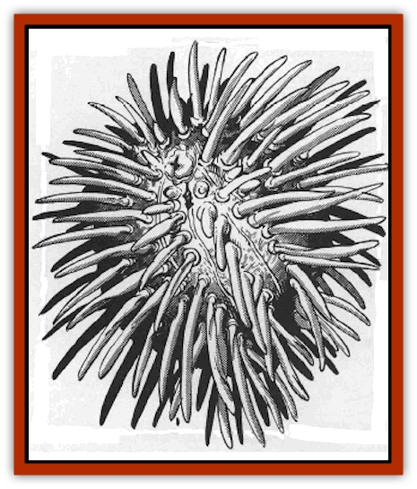

# Zurchin

| Statistic | **Zurchin** |
| --- | --- |
| **Activity Cycle:** | Any |
| **Alignment:** | Neutral |
| **Armor Class:** | 4 |
| **Climate/Terrain:** | Wildspace, asteroid fields |
| **Damage/Attack:** | 1d4 + 2 Poison Spines |
| **Diet:** | Omnivore |
| **Frequency:** | Common |
| **Hit Dice:** | 1+1 |
| **Intelligence:** | Non- (0) |
| **Magic Resistance:** | 1% |
| **Morale:** |  |
| **Movement:** | 8 |
| **No. Appearing:** | 1-3 |
| **No. of Attacks:** | 2 |
| **Organization:** | Solitary |
| **Size:** | 120 |
| **Special Attacks:** | Nil |
| **Special Defenses:** | T (6&rdquo; to 1' diameter) |
| **THAC0:** | 19 |
| **Treasure:** | Nil |
| **XP Value:** |  |

The zurchin, commonly called "star urchin" or "space porcupine", is a spherical mollusk with myriad radial spines. It moves slowly, using a muscular belly-foot for propulsion. The zurchin scavenges organic matter, dust, and wood.

Individuals appear in many bright colors, yellow and red, purple and blue. Striped varieties are not uncommon. They range in size from 6" to a foot in diameter.

**Combat:** The zurchin normally attacks only when disturbed. It shoots poisonous hollow spines, using gas pressure so great that the range of the spines matches an arrow's. The zurchin can fire 1d4 spines per round, pegging a man-sized target with deadly accuracy. These spines are the equivalent of +2 darts, doing 1d4+2 points of damage. A zurchin typically has hundreds of spines.

Their poison is released on impact, expelled by a small sac inside the spine. The poison paralyzes the victim's heart and breathing; the victim must save vs. poison or die in 2d6 hours. A successful save negates subsequent poison damage; after a slight fever and nausea, the target develops immunity to the zurchin's poison.

**Habitat/Society:** Zurchins inhabit the rocks of asteroid reefs, eating bits of cast-off food that fall into the gravity planes. They frequently lair among colonies of [[Mortiss|mortiss]].

**Ecology:** Zurchins are peaceful scavengers. A zurchin's spines conceal a complex 40-part mouth that can extrude hard, sharp teeth. Given hours or days, these teeth can excavate holes in wood, rock, and even iron. The zurchin uses the holes as hiding places or mating areas.

Ten to 20 of a female zurchin's darts each contain thousands of microscopic eggs. If an egg is implanted in a victim (5% chance), the victim suffers no poison or ill effects (except impact damage). Over the next week, the egg-bearer loses its appetite, becomes confused, and begins to itch uncontrollably. At the end of a week the victim is paralyzed and dies of suffocation. Then each egg hatches a tiny new zurchin, which feeds on its dead host and it fellow hatchlings. A *cure disease* spell destroys the incubating eggs.

The egg-laden dart can also lodge in a wooden or organic spell jammer hull. Incubation time doubles to two weeks. A spell jammer may be far away from the original asteroid reef when the crew discovers a sudden, major zurchin infestation. Even worse they may not discover it until too late. More than one dragonfly ship has surprised its small crew by collapsing suddenly, leaving nothing intact but the helm and a few hundred zurchins.

To wealthy and decadent [[Neogi|neogi]], the zurchin is a particularly prized delicacy. Specialist chefs prepare the zurchin meat (ordinarily a deadly poison to the neogi) in a secret way that neutralizes the poison � usually. The resulting dish attracts rich neogi diners less for its exotic taste than for its danger; occasionally a diner fails to survive the evening.

The neogi specialist chefs, called "white sashes" for their characteristic garb, belong to a caste of familial dynasties engaged in cutthroat competition to gain one another's trade secrets. All white-sash neogi pay handsomely for zurchin meat, so penurious spelljammers risk their lives to harvest the unassuming scavengers.

Besides neogi, predators such as [[Firebird|firebirds]] consider zurchin meat tasty.

---
## Discovery & Documentation

**Source Publication:** MC9 Spelljammer Appendix II (1991)
**Campaign Setting:** Planescape
**Author(s):** Scott Davis, Newton Ewell, John Terra

### Other Creatures Found in This Source Book
   * [[Alchemy_Plant|Alchemy Plant]]
   * [[Allura|Allura]]
   * [[Aperusa|Aperusa]]
   * [[Autognome|Autognome]]
   * [[Bionoid|Bionoid]]
   * [[Bloodsac|Bloodsac]]
   * [[Buzzjewel|Buzzjewel]]
   * [[Constellate|Constellate]]
   * [[Contemplator|Contemplator]]
   * [[Dohwar|Dohwar]]
   * [[Dragon_Moon|Dragon, Moon]]
   * [[Dragon_Stellar|Dragon, Stellar]]
   * [[Dragon_Sun|Dragon, Sun]]
   * [[Dreamslayer|Dreamslayer]]
   * [[Dweomerborn|Dweomerborn]]
   * [[Fal|Fal]]
   * [[Feesu|Feesu]]
   * [[Fire_Bat|Fire Bat]]
   * [[Firebird|Firebird]]
   * [[Firelich|Firelich]]
   * [[Flowfiend|Flowfiend]]
   * [[Gadabout|Gadabout]]
   * [[Gammaroid|Gammaroid]]
   * [[Gonn|Gonn]]
   * [[Gossamer|Gossamer]]
   * [[Grav|Grav]]
   * [[Great_Dreamer|Great Dreamer]]
   * [[Greatswan|Greatswan]]
   * [[Grell_Colonial|Grell, Colonial]]
   * [[Gullion|Gullion]]
   * [[Insectare|Insectare]]
   * [[Lhee|Lhee]]
   * [[Mercurial_Slime|Mercurial Slime]]
   * [[Meteorspawn|Meteorspawn]]
   * [[Monitor|Monitor]]
   * [[Owl_Space|Owl, Space]]
   * [[Pristatic|Pristatic]]
   * [[Scro|Scro]]
   * [[Selkie_Star|Selkie, Star]]
   * [[Silatic|Silatic]]
   * [[Skullbird|Skullbird]]
   * [[Sleek|Sleek]]
   * [[Sluk|Sluk]]
   * [[Space_Swine|Space Swine]]
   * [[Sphinx_Astro-|Sphinx, Astro-]]
   * [[Spirit_Warrior|Spirit Warrior]]
   * [[Starfly_Plant|Starfly Plant]]
   * [[Stargazer|Stargazer]]
   * [[Undead_Stellar|Undead, Stellar]]
   * [[Witchlight_Marauder|Witchlight Marauder]]
   * [[Xixchil|Xixchil]]
   * [[Yitsan|Yitsan]]
