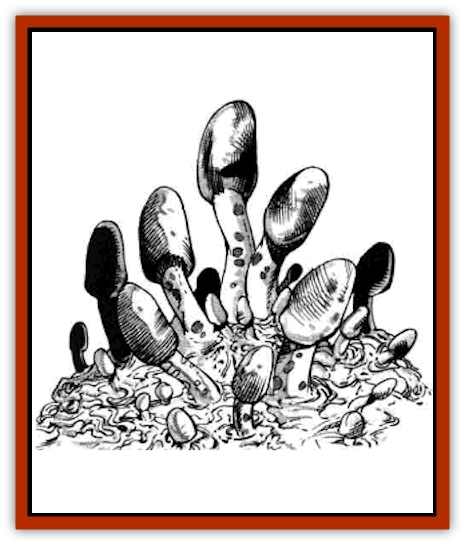

# Zygom

| Statistic | **Zygom** |
| --- | --- |
| **Activity Cycle:** | Any |
| **Alignment:** | Neutral evil |
| **Armor Class:** | 6 |
| **Climate/Terrain:** | Any/Land |
| **Damage/Attack:** | Special (or host's weapon) |
| **Diet:** | Human tissue |
| **Frequency:** | Rare |
| **Hit Dice:** | 3 (or host's HD) |
| **Intelligence:** | Non- (0) |
| **Magic Resistance:** | Nil |
| **Morale:** | Special |
| **Movement:** | 1 (or host's movement) |
| **No. Appearing:** | 1-3 |
| **No. of Attacks:** | 1 (or host's attacks) |
| **Organization:** | Solitary |
| **Size:** | One-sixth to one quarter foot per growth (or by host's size) |
| **Special Attacks:** | Milky glue |
| **Special Defenses:** | Nil |
| **THAC0:** | 17 (or host's THAC0 |
| **Treasure:** | Incidental (or host's possessions) |
| **XP Value:** | 120 |

Zygoms are small, individual fungoid growths that consist of a short, thin stem with an ovoid cap. One or two dozen such growths are joined by a rhizome structure to form a singular communal creature, a zygom.

**Combat:** The zygom does not attack, per se. Whenever a colony of zygoms comes in rough contact with any creature, there is a 1 in 6 chance that the pale blue "milk" of a broken cap sticks fast to the creature. This milk is extremely sticky, and has the power to glue materials together for 1d4+1 days before the substance dries and crumbles. Zygom glue can be otherwise embarrassing, for it can stick weapons to targets, creatures to creatures, etc. If glued to flesh, a colony of zygom spores will infect the creature and begin growth by the time the glue powders, allowing the zygoms to infest and control the host. (For more on the consequences of infestation, see "Ecology" below.)

As zygoms have fungoid intelligence that is totally alien to humans, no magic affecting the mind � *beguiling*, *charming*, *dominating*, *hypnotizing*, or *hold* spells, etc., affects them.

**Habitat/Society:** Zygoms are found only near the Barrier Peaks region for reasons that are not readily apparent. Since these strange creatures are a strange, new form of life with an unknown form of intelligence or social structure, it has been surmised that zygoms are alien monstrosities that have somehow arrived here in Greyhawk. Since they are certainly harmful and dangerous, one might assume that they have been deliberately sent here, but few believe this to be the case. It is believed that a true invasion, or even a subtle assault, would require more than one drop zone for the invaders, to account for the possibility of landing in molten lava, deep oceans, or the freezing arctic. Undoubtedly, the creatures came here accidentally. Scholars are divided as to whether this is a generally good or bad thing.

**Ecology:** Although able to exist in the ground, zygoms prefer to dst living flesh and nourish themselves on the host's blood and tissue. Typical host creatures are [[Ant|giant ants]], [[Rat|giant rats]], [[Badger|large badgers]], young [[Bear|bears]], and occasionally small humanoids ([[Dwarf|dwarves]], [[Halfling|halflings]], [[Gnome|gnomes]], and the like). Theoretically, it is possible for a large creature (man-sized or even greater) to become a host, but it might not be possible unless the foolish traveler chose to lay down on top of one of these rare alien fungi.

Infestation is typically on the head, neck and back (spinal areas). Importantly, this type of infestation controls the host creature by brain and nerve connections. The host creatures move, attack, and defend according to the dictates of the possessing zygoms. This infestation leads to death in 1d8 weeks, depending on the size and constitution of the host creature.

For example, a tiny creature, like a giant worker ant, might last no more than a week or two, while a stout-hearted halfling warrior might be capable of holding out maybe six, or even seven weeks. With luck, this might allow for enough time to reach help, if the zygoms allow it, of course.

Note that, even after death, the zygom remains until the whole of the dead body is consumed and only then does it move on. Most importantly, the only known cure for a zygom infestation (other than such rare and wondrous magic such as *wish* and *alter reality* spells) is a *cure disease* spell.

Since little is known about the zygom, and even less about how it arrived in Greyhawk, an expedition to the Barrier Peaks might be warranted in the near future. Who knows what other alien mysteries might be uncovered there?

---
## Discovery & Documentation

**Source Publication:** MC5 Greyhawk Appendix (1989)
**Campaign Setting:** Advanced Dungeons & Dragons 2nd Edition
**Author(s):** Grant Boucher, William W. Connors, Steve Gilbert, Bruce Nesmith, Chris Mortika, Skip Williams

### Other Creatures Found in This Source Book
   * [[Aspis|Aspis]]
   * [[Beastman|Beastman]]
   * [[Bonesnapper|Bonesnapper]]
   * [[Booka|Booka]]
   * [[Brownie_Buckawn|Brownie, Buckawn]]
   * [[Brownie_Quickling|Brownie, Quickling]]
   * [[Crystalmist|Crystalmist]]
   * [[Dragon_Cloud|Dragon, Cloud]]
   * [[Dragon_Oerth_Greyhawk|Dragon (Oerth), Greyhawk]]
   * [[Dragonfly_Giant|Dragonfly, Giant]]
   * [[Dragonnel|Dragonnel]]
   * [[Elf_Grugach|Elf, Grugach]]
   * [[Elf_Valley|Elf, Valley]]
   * [[Golem_Necrophidius|Golem, Necrophidius]]
   * [[Grell_Wild|Grell, Wild]]
   * [[Grung|Grung]]
   * [[Hobgoblin_Norker|Hobgoblin, Norker]]
   * [[Hook_Horror|Hook Horror]]
   * [[Horgar|Horgar]]
   * [[Hound_Yeth|Hound, Yeth]]
   * [[Iguana_Giant|Iguana, Giant]]
   * [[Ingundi|Ingundi]]
   * [[Kech|Kech]]
   * [[Kyuss_Son_of|Kyuss, Son of]]
   * [[Mite|Mite]]
   * [[Needleman|Needleman]]
   * [[Plant_Carnivorous_Oerth|Plant, Carnivorous (Oerth)]]
   * [[Plant_Carnivorous_Vampire_Cactus|Plant, Carnivorous, Vampire Cactus]]
   * [[Plasmoid_General_Information|Plasmoid, General Information]]
   * [[Rat_Oerth|Rat (Oerth)]]
   * [[Raven_Crow|Raven/Crow]]
   * [[Scarecrow|Scarecrow]]
   * [[Shadow_Slow|Shadow, Slow]]
   * [[Skulk|Skulk]]
   * [[Snail|Snail]]
   * [[Sprite|Sprite]]
   * [[Taer|Taer]]
   * [[Tentamort|Tentamort]]
   * [[Turtle_Giant|Turtle, Giant]]
   * [[Tyrg|Tyrg]]
   * [[Wolf_Mist|Wolf, Mist]]
   * [[Wraith_Oerth|Wraith (Oerth)]]
