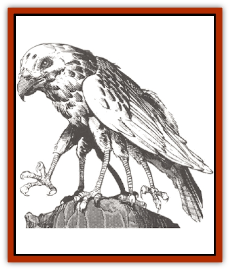

# Zygraat

| Statistic | **Zygraat** |
| --- | --- |
| **Activity Cycle:** | Day |
| **Alignment:** | Neutral |
| **Armor Class:** | 3 |
| **Climate/Terrain:** | Forest |
| **Damage/Attack:** | 1d4 + Special |
| **Diet:** | Carnivore |
| **Frequency:** | Uncommon |
| **Hit Dice:** | 1 |
| **Intelligence:** | Semi- (4) |
| **Magic Resistance:** | Nil |
| **Morale:** | Average (10) |
| **Movement:** | 24 (C), Wb 12 |
| **No. Appearing:** | 1 |
| **No. of Attacks:** | 1 |
| **Organization:** | Solitary |
| **Size:** | S (4') |
| **Special Attacks:** | Poison or discharge web |
| **Special Defenses:** | Nil |
| **THAC0:** | 19 |
| **Treasure:** | Nil |
| **XP Value:** | 270 |

More commonly known as spider [[Hawk|hawks]], zygraats are an unusual cross between a [[Bird|bird]] and a [[Spider|spider]]. Unlike true birds, this creature is able to entrap its prey through its web and poisonous bite.

Zygraats are readily identifiable by anyone who has ever heard of theme for they ramble six-legged birds of prey with a spiderlike underbelly and abdomen. If the creature's mouth is examined closely, a series of tiny, hollow fangs will be observed running along both ridges of its jaw. The abdomen of the monster is grey in color and, if cut open, will be found to contain a milky fluid that coalesces into a mass of silky threads upon exposure to air.

**Combat:** The more passive attack form of the zygraat is to weave a large web some ten feet square within a tree or between two opposing vertical surfaces. It then flies up to a vantage point to wait. While the web is not sticky, it is made up of several different layers of fine silky each laid against the other, creating a netlike barrier. This webbing has an incredible strength but is only lightly secured. Prey wandering into this web thus pulls it free from its anchoring points and becomes trapped during that round. Immediately, the zygraat will swoop down from its vantage point and attack with a bite that delivers 1-4 points of damage, forcing its victim to make a save vs. poison or suffer 3d6 points of additional damage. The entangled prey is then permitted a saving throw against paralysis each round to work itself free of the net.

The zygraat's other means of attack is to project a stream of netting from its abdomen at a man-sized or smaller target within 50'. The monster often resorts to this attack when hunting away from its lair. This attack is usable three times in any 24-hour period, and the victim is allowed a save vs. wands to dodge aside only if he/she is not surprised. Failure to make the save, or being caught by surprise, means that the victim is trapped as above. This particular attack is possible only if the zygraat is perched upon a tree or other roosting spot, and cannot be employed while it is in flight.

**Habitat/Society:** Adult males of this species are somewhat rare, for in the process of mating, they are killed and devoured by the female, which soon thereafter lays 6d6 egg sacks in a weblike nest that she builds atop high trees or in rocky cliffsides. Baby zygraats lack the ability to fly or form webs, but can scurry upon their legs, climbing up and down trees, rock or web with ease. Their bite inflicts 1 point of damage, plus an additional 1-4 points of poison damage if a saving throw is failed.

Zygraats are not interested in treasure or gems. They will ignore anything shiny, but will utilize shreds of clothing or other material for their nest-building. They will occasionally secure brightly-colored bits of cloth to trees or rocks near their webs to attract curious creatures to their doom.

Nesting zygraats with young will often have a larder of fresh meat nearby to feed their ravenous youngsters.

**Ecology:** For the most part, zygraats do not pose a great threat as they are found only in isolated forest areas. The monsters also prefer relatively small prey, and thus they will tend to avoid most adventurers unless their nets are threatened.

The fluid within the creature's abdomen is prized, for if used in casting a web spell, all those caught inside the web's area of effect must save at -3 when trying to escape. Each full abdomen provides a wizard with sufficient material for three such uses.

The zygraat's webs can also be fashioned into a robe that affords excellent protection against attack, granting an armor class bonus of three points. Each full web can be made into a single man-sized garment.

---
## Discovery & Documentation

**Source Publication:** MC14 Fiend Folio Appendix (1992)
**Campaign Setting:** Fiends Folio
**Author(s):** Don Bingle, John Terra, Wes Nicholson, Tim Beach, Steve Hardinger, Kris Hardinger, Rob Nicholls, Greg Swedberg, Al Boyce, Vince Garcia, Norm Ritchie

### Other Creatures Found in This Source Book
   * [[Aballin|Aballin]]
   * [[Achaierai|Achaierai]]
   * [[Adherer|Adherer]]
   * [[Algoid|Algoid]]
   * [[Al-Mi'raj|Al-Mi'raj]]
   * [[Apparition|Apparition]]
   * [[Caterwaul|Caterwaul]]
   * [[Coffer_Corpse|Coffer Corpse]]
   * [[Crabman|Crabman]]
   * [[Dark_Creeper|Dark Creeper]]
   * [[Dark_Stalker|Dark Stalker]]
   * [[Darter|Darter]]
   * [[Denzelian|Denzelian]]
   * [[Dune_Stalker|Dune Stalker]]
   * [[Dwarf_Urdunnir|Dwarf, Urdunnir]]
   * [[Falcon_Fire|Falcon, Fire]]
   * [[Faux_Faerie|Faux Faerie]]
   * [[Flawder|Flawder]]
   * [[Fyrefly|Fyrefly]]
   * [[Gambado|Gambado]]
   * [[Garbug|Garbug]]
   * [[Giant_Fhoimorien|Giant, Fhoimorien]]
   * [[Gibberling|Gibberling]]
   * [[Gorbel|Gorbel]]
   * [[Grimlock|Grimlock]]
   * [[Hellcat|Hellcat]]
   * [[Ice_Lizard|Ice Lizard]]
   * [[Iron_Cobra|Iron Cobra]]
   * [[Khargra|Khargra]]
   * [[Mantari|Mantari]]
   * [[Penanggalan|Penanggalan]]
   * [[Pernicon|Pernicon]]
   * [[Phantom_Stalker|Phantom Stalker]]
   * [[Retriever|Retriever]]
   * [[Ruve|Ruve]]
   * [[Scathe|Scathe]]
   * [[Sheet_Ghoul_Sheet_Phantom|Sheet Ghoul/Sheet Phantom]]
   * [[Shocker|Shocker]]
   * [[Spanner|Spanner]]
   * [[Stwinger|Stwinger]]
   * [[Sussurus|Sussurus]]
   * [[Symbiotic_Jelly|Symbiotic Jelly]]
   * [[Terithran|Terithran]]
   * [[Thunder_Children|Thunder Children]]
   * [[Troll_Ice|Troll, Ice]]
   * [[Tween|Tween]]
   * [[Umpleby|Umpleby]]
   * [[Volt|Volt]]
   * [[Xill|Xill]]
   * [[Xvart|Xvart]]
