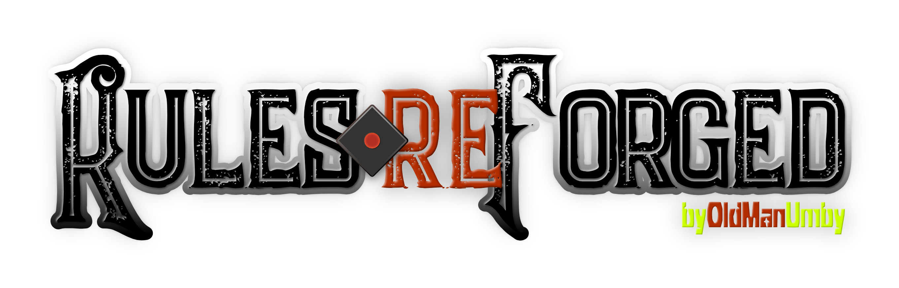

---

>**SPECIAL NOTE:** This ruleset library is under development and missing many components! When this warning disappears, the ruleset will be complete. Currently, the monster section is more then complete!

---

# Advanced Dungeons & Dragons 2nd Edition Complete Rules reForged!

This material contains a **reForged, reOrganized, and rePublished** markdown (.md) adaptation of the original Advanced Dungeons & Dragons 2nd Edition CD-ROM ruleset and documentation to use for private, non-comercial purposes at your gametable. Specifically, for use with desktop PKM application that utilize wikilinks, such as [Obsidian](https://obsidian.md), [Docmost](https://docmost.com), and [iA Writer](https://ia.net/writer).

To download and use this material, you declare you own the physical works contained herein. Please report any issues or discrepancies of the converted material; see **rePport & reFork** below. This is not an SRD, but rather the complete markdown ruleset.

> Credit: Thanks to [Decheine](https://github.com/decheine) for the great work on his [Complete Monstrous Compendium](https://github.com/decheine/complete-compendium).

For additional information and other complete reForged rulesets, please visit the [Rules reForged Hub](https://rules.oldmanumby.com).

[Download](../../archive/refs/heads/main.zip) this markdown in a .ZIP file.

 
Why Markdown format?

Markdown is a lightweight markup language with plain text formatting syntax created by [John Gruber](https://daringfireball.net). By its very nature, being a plain text file, it is designed to add future-proofing to any set of documents while still maintaining basic text and table formatting options.

In addition, Markdown may be exported to HTML and many other formats using a number of various Markdown editors. Markdown is often used to format README files, for writing books, blogs, and messages, or to simply create rich text using plain text in a Markdown editor.

 
Editing & Exporting

I recommend using the following Markdown applications to edit the material:

* [Visual Studio Code for Editing](https://code.visualstudio.com/Download): **FREE!** Markdown Plugins: **FREE!**
* [Typora for Editing/Exporting](https://typora.io): **$15** (Pay Once; MacOS, Windows, and Linux)

To export markdown to other publishing formats, I recommend using ***Typora*** as it has many good export options that will satisfy the majority of users. Most good Markdown editors will offer basic exports. However, if you want even more export formats and options, [PanWriter](https://panwriter.com) is the best solution, but you'll need [PanDoc](https://pandoc.org) installed to get the best results. Both are **FREE!**

 
PKM-Friendly

This SRD material contains optional content organized specifically for personal knowledge management (PKM) applications like [Obsidian.md](https://obsidian.md). Obsidian is a powerful knowledge base on top of a local folder of markdown (.md) files. That definition sounds simple; however, when add some RPG plugins, Obsidian becomes so much more.

Visit [Josh Plunket's Website](https://obsidianttrpgtutorials.com) to learn more about using Obsidian for your roleplaying game campaign management.

 
rePport & reFork

Please **rePort** any [issues](../../issues) you find through GitHub. As an alternative, you can **reFork** this project through a GitHub [pull request](../../pulls).

